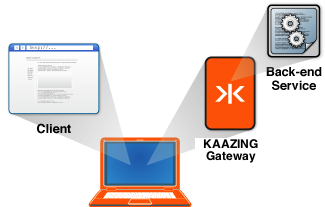
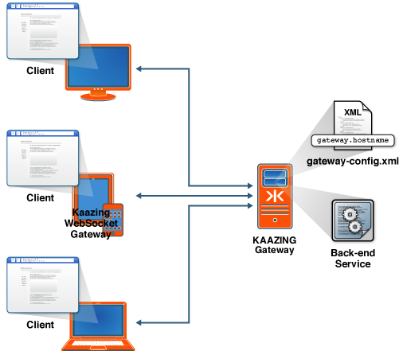

Setting Up the Gateway
=========================

This guide helps you download the Gateway distribution and set it up in your environment:

-   [Setting Up KAAZING Gateway Locally on My Computer](#setting-up-kaazing-gateway-locally-on-my-computer)
-   [Setting Up KAAZING Gateway on a Server](#setting-up-kaazing-gateway-on-a-server)
-   [Setting Up a Secure KAAZING Gateway Configuration](#setting-up-a-secure-kaazing-gateway-configuration)
-   [Uninstall KAAZING Gateway](#uninstall-kaazing-gateway)

Let's get started!

Setting Up KAAZING Gateway Locally on My Computer
-----------------------------------------------------------------------------------------------

Setting up KAAZING Gateway on your local computer is recommended if you want to quickly try out the Gateway.



**Figure: A Localhost Configuration for KAAZING Gateway**

To download and set up the Gateway on your local computer, perform the following steps:

1.  Ensure your system meets the system requirements. See the [README.md](https://github.com/kaazing/gateway/blob/master/README.md), or you can find the `README.txt` in the `GATEWAY_HOME` directory if you have already unpacked the the Gateway distribution.
2.  Download the Gateway or fork the Gateway GitHub repository from [kaazing.org](http://kaazing.org):
    -   For Linux, Unix, and Mac: kaazing-gateway-community-5.0.*x*-unix.tar.gz
    -   For Windows: kaazing-gateway-community-5.0.*x*-windows.zip

3.  Install the Gateway by unpacking the compressed download of the Gateway.

    Unpack the Gateway to any directory location. Unpacking creates the Gateway directory structure into a directory of your choice (for example, `C:\kaazing` or `/home/username/kaazing`). See [About GATEWAY\_HOME](../about/about.md#about-gateway_home) to learn more about KAAZING Gateway directory destinations.

4.  Start the Gateway.

    -   For Windows: use the Windows Services Manager or use the `net start` command with administrator rights. Alternatively, in Windows Explorer, navigate to the `GATEWAY_HOME/bin` directory where you unpacked the Gateway and double-click the `gateway.start.bat` script.
    -   For Linux: `sudo service kaazing-gateway-community-5.0.x-platform start`
    -   For Ubuntu (Upstart): `sudo start kaazing-gateway-community-5.0.x-platform`
    -   For Linux, UNIX, or Mac: run the `gateway.start` script by navigating to the `GATEWAY_HOME/bin` directory where you installed the Gateway and enter `./gateway.start` on the command line.

    When you successfully start the Gateway, messages display in your shell or command prompt indicating the services that are hosted by the Gateway. The startup message may differ depending on your Gateway configuration. To verify that the Gateway started correctly as a service, look at the log file in `GATEWAY_HOME/log/service.log` that is generated when the service is started or stopped. If the server does not start successfully, see [Troubleshoot KAAZING Gateway Configuration and Startup](../troubleshooting/p_troubleshoot_gateway_configuration.md) or contact your administrator.

5.  Verify the Gateway setup.

    To verify that the Gateway is up and running, open a browser and access the Gateway home page at `http://localhost:8000/`. The "It Works!" page displays and automatically starts a simple WebSocket demo. Also try clicking "Command Center" on this page to view the Gateway with a browser-based application that is provided in the default Gateway configuration. See [Monitor with Command Center](../management/p_monitor_cc.md) for instructions.

You are now done setting up the Gateway locally.

-   To start building your first application, see the [For Developers](../index.md#for-developers) documentation topics.
-   For more information about configuration settings and to perform additional Gateway configuration, see [About Gateway Configuration](../admin-reference/c_configure_gateway_concepts.md).
-   For real-world demos, see <http://kaazing.org/>.
-   To uninstall the Gateway, see the [Uninstall KAAZING Gateway](#uninstall-kaazing-gateway) section at the end of this document.

Setting Up KAAZING Gateway on a Server
----------------------------------------------------------------------------------

You can override the Gateway default behavior and accept connections on a non-localhost host name or IP address.



**Figure: A Server Configuration for KAAZING Gateway**

To set up a server configuration:

1.  Follow the directions in [Setting Up KAAZING Gateway Locally on My Computer](#setting-up-kaazing-gateway-locally-on-my-computer).
2.  Stop the Gateway.
    -   To stop the Gateway on Windows, use the Windows Services Manager, press **CTRL + C** at the command prompt that was used to start the Gateway or simply close the command prompt, or use the `net stop` command to stop the Gateway service.
    -   To stop the Gateway on Linux, UNIX, and Mac, kill the process at the command line, or use the Linux or Ubuntu (Upstart) service `stop` command.

3.  Navigate to the `GATEWAY_HOME/conf/` directory and edit the Gateway configuration to update the value of the `gateway.hostname` property by replacing `localhost` with your host name or IP address.
    1.  Edit either of the Gateway configuration file options: `gateway-config.xml` or `gateway-config-minimal.xml`, or edit your custom configuration file if you created one. The Gateway configuration files are described in detail in [About Gateway Configuration](../admin-reference/c_configure_gateway_concepts.md).
    2.  Replace `localhost` with your host name or IP address.

        For example, the hostname `example.com` replaces `localhost` as the property value for `gateway.hostname` in the following Gateway configuration file:

        ``` xml
        <properties>
          <property>
            <name>gateway.hostname</name>
            <value>example.com</value>
          </property>
          <property>
            <name>gateway.base.port</name>
            <value>8000</value>
          </property>
          <property>
            <name>gateway.extras.port</name>
            <value>8001</value>
          </property>
        </properties>
        ```

        **Note:** You can optionally specify default values for configuration elements using the `properties` element in the "Property defaults" section of the Gateway configuration file. Doing so is recommended because it allows you to define a property value once and have its value used throughout the configuration.

4.  If you are using a message broker, start it.
5.  Start and verify the Gateway (as described in [Setting Up KAAZING Gateway Locally on My Computer](#setting-up-kaazing-gateway-locally-on-my-computer)).

Setting Up a Secure KAAZING Gateway Configuration
--------------------------------------------------------------------------------------------

By default, the Gateway listens for non-encrypted traffic. Secure communication between the browser and the server is necessary to ensure that only the intended recipient of a message can read the transmitted message and to allow the message recipient to trust that the message is indeed from the expected source.


**Figure: An Encrypted Configuration Using KAAZING Gateway**

For secure communication with the Gateway, consider configuring for the following levels of security:

-   **Secure network traffic** Configure Transport Layer Security (TLS, also known as SSL) for secure communications channels to access the Gateway by setting up certificates. See [Secure Network Traffic with the Gateway](../security/o_tls.md) for more information.
-   **Limit access to services** Use Cross-Origin Resource Sharing to control access to Gateway services based on the origin of an application by configuring cross-site constraints in the `gateway-config.xml` file. See [Configure the HTTP Challenge Scheme](../security/p_authentication_config_http_challenge_scheme.md) for more information.
-   **Configure authentication and authorization** with constraints to limit access to Gateway services to authenticated and authorized users. See [Configure Authentication and Authorization](../security/o_auth_configure.md) for more information.
-   **Configure Kerberos network authentication**  for network authentication and communication between trusted hosts on untrusted networks. See [Configure Kerberos V5 Network Authentication](../security/o_auth_configure.md) for more information.

Uninstall KAAZING Gateway
-------------------------------------------------------

Uninstall the Gateway by stopping all the services and deleting the directory that contains the Gateway files.
