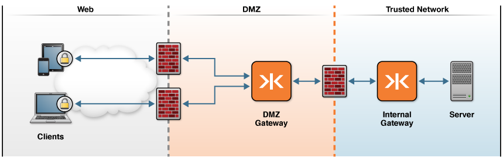

Common KAAZING Gateway Production Topologies
========================================================================

This topic describes some of the most common production topologies for the KAAZING Gateway. It is intended to familiarize network administrators and systems software developers with general KAAZING Gateway production deployments. Your actual production deployment of the Gateway will likely be some variation of the topologies covered here.

All of the topologies in this topic begin with clients on one end and the back-end service or message broker at the opposite end of the connection. It is the number and configuration of Gateway instances between the clients and the back-end service or message broker that distinguishes each Gateway topology.

Developers that want to develop against the Gateway can run the Gateway locally as described in [Setting Up the Gateway](../about/setup-guide.md).

**Note:** Most topologies use Gateway clustering and load balancing. For information on using these features, see [Configure the Gateway for High Availability](../high-availability/o_high_availability.md).

This topic covers the following information:

-   [DMZ to Trusted Network Topology](#dmz-to-trusted-network-topology)
    -   [Deploying the DMZ to Trusted Network Topology](#deploying-the-dmz-to-trusted-network-topology)
-   [Enterprise Shield™](#enterprise-shield--)
-   [Virtual Private Connection](#virtual-private-connection)
-   [TLS/SSL Security Considerations](#tlsssl-security-considerations)

DMZ to Trusted Network Topology
-------------------------------------------------------------

In this topology, client to back-end service or message broker connections are protected by two layers of network security, a firewall-protected DMZ and a firewall-protected Trusted Network. A Gateway or Gateway cluster is deployed in the firewall-protected DMZ peripheral network to service requests from KAAZING Gateway clients on the Web. The DMZ Gateway connects through a firewall to a second Gateway deployed in the internal, Trusted Network. The Internal Gateway connects to the back-end service or message broker.

Here is an example of the topology.

**Figure: DMZ to Trusted Network Topology**

### Deploying the DMZ to Trusted Network Topology

Deploying this topology involves the following:

1.  Configure the Internal Gateway to connect with the back-end service or message broker using an internal URI. For more information, see the `service` element. The internal URI might be something such as `tcp://broker.internal.com:8080`.
2.  Configure the DMZ Gateway to proxy client requests to the Internal Gateway using a private, internal URI. The DMZ Gateway to Internal Gateway is a full duplex, bidirectional communication over WebSocket, TCP, UDP, or SSL.
3.  Configure the DMZ Gateway to listen on a public URI for clients, such as `wss://example.com:443/path`.
4.  Configure KAAZING Gateway clients to connect to the DMZ Gateway using the public URI. Once the clients are connected to the DMZ Gateway, full duplex, bidirectional communication is established and communication flows in both directions simultaneously.

This topology is typically deployed using Gateway clustering and load balancing. For more information, see [Configure the Gateway for High Availability](../high-availability/o_high_availability.md). Load balancing can also be performed by a third party load balancer.

Enterprise Shield™  
---------------------------------------------------------------------

Enterprise Shield™ protects your enterprise network by using reverse connectivity (a reverse proxy connection) to initiate the connection from the Gateway in the internal, Trusted Network towards a DMZ Gateway. The Enterprise Shield™ topology is documented in depth in [About Enterprise Shield™](../enterprise-shield/o_enterprise_shield_checklist.md#about-enterprise-shield).

Virtual Private Connection
--------------------------------------------

In this topology, the VPC solution (sometimes called *NoVPN*) transparently uses the Web Tier for all of its secure communication. This topology provides a VPN-style solution without the need for specialist VPN software.

KAAZING Gateway can be configured to allow TCP (and UDP) clients to connect to servers over the Web without the need for any special WebSocket libraries, thus creating a virtual private connection. KAAZING Gateway is designed not only to proxy TCP protocols using the WebSocket protocol, but to run in a WebSocket protocol to TCP mode. This design allows system and network administrators to configure two or more Gateway instances to enable applications to traverse the Web securely through firewalls and proxy servers. The VPC topology delivers sophisticated server-to-server systems and rich client applications over a LAN or WAN web infrastructure in the same manner as conventional distributed applications, all without the expense or complexity of a private line.

TLS/SSL Security Considerations
-------------------------------------------------

KAAZING Gateway topologies use TLS/SSL to ensure that network intermediaries, such as transparent proxy servers and firewalls that are unaware of WebSocket, do not drop the WebSocket connection. WebSocket uses the same HTTP upgrade method commonly used to upgrade HTTP connections to HTTPS. Intermediaries unfamiliar with WebSocket might drop the unfamiliar WebSocket upgrade as a security precaution, preventing the WebSocket connection. When using the WSS connection over TLS/SSL, however, intermediaries trust the WSS connection and allow it to pass.

When using TLS/SSL with Gateway topologies, the Gateway must provide KAAZING Gateway clients (built using KAAZING Gateway libraries) with the certificate for the domain name in the URI that the clients use to connect to the Gateway. If TLS/SSL is deployed between Gateway instances, then certificates must be used for the hostnames in the URIs used by the connected Gateway instances.

For more information, see [TLS/SSL with the Gateway Example](../security/u_tls_works.md#tlsssl-with-the-gateway-example) and [Secure Network Traffic with the Gateway](../security/o_tls.md).
