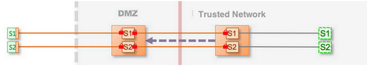

-   [Home](../../index.md)
-   [Documentation](../index.md)
-   Security with KAAZING Gateway

Walkthrough: Configure Enterprise Shield™  
===========================================

In this walkthrough, you will learn how to deploy a maximum security Enterprise Shield™ configuration, which is a recommended configuration for Enterprise Shield™ because it provides end-to-end security. This architecture, referred to as Use Case 3 in [Common Enterprise Shield™ Use Cases](c_enterprise_shield_use_cases.md), provides secure communication over the Web that uses TLS between the client and the DMZ Gateway (described in Use Case 2) and drastically reduces the attack vectors in the DMZ, creating an ultra-secure environment with which to deploy services over the public Web.

This walkthrough is part of [Configure Enterprise Shield™ for KAAZING Gateway](o_enterprise_shield_checklist.md) that links to all Enterprise Shield™ topics, including those that describe the concepts behind Enterprise Shield™ and Gateway topologies.

This walkthrough describes the following subjects:

1.  [What You Will Accomplish](#step-1-what-you-will-accomplish)
2.  [Before You Begin](#step-2-before-you-begin)
3.  [Download and Set Up KAAZING Gateway](#step-3-download-and-set-up-kaazing-gateway)
4.  [Configure the Internal Gateway](#step-4-configure-the-internal-gateway)
5.  [Configure the DMZ Gateway](#step-5-configure-the-dmz-gateway)
6.  [Configure Security Between the DMZ and Internal Gateways](#step-6-configure-security-between-the-dmz-and-internal-gateways)
7.  [Verify the Gateways are Running](#step-7-verify-the-gateways-are-running)
8.  [Close Inbound ports](#step-8-close-inbound-ports)
9.  [Verify the End-to-End Configuration](#step-9-verify-the-end-to-end-configuration)

Step 1: What You Will Accomplish
---------------------------------------------------------

At the end of this walkthrough, you will have configured a maximum security Enterprise Shield™ topology.



**Figure: Maximum (End-to-End) Transport Security**

In this topology, the Gateway on the internal trusted network and a DMZ Gateway collaborate so that inbound ports of the firewall can be closed. Doing so provides a barrier to unauthorized users but still allows full bidirectional access. It works because of the collaboration between the internal Gateway and DMZ Gateway. The internal Gateway is configured to be totally opaque and hides all internal DNS names, IP addresses, and so on. The internal Gateway completes the connection initiated through a client request by accessing the outbound ports on the DMZ Gateway. There are no changes to any application logic.

Step 2: Before You Begin
----------------------------------------------

This walkthrough covers Use Case 3: Maximum (End-to-End) Transport Security from the set of [Common Enterprise Shield™ Use Cases](c_enterprise_shield_use_cases.md#usecase3) because that is the most secure example of Enterprise Shield™. By the end of this walkthrough, you will have the foundational knowledge required to understand and configure any of the Enterprise Shield™ use cases.

Step 3: Download and Set Up KAAZING Gateway
---------------------------------------------------------------

Download and set up two KAAZING Gateways, with one Gateway in the DMZ and one in the internal trusted network. This is described in [Setting Up the Gateway](../about/setup-guide.md).

Step 4: Configure the Internal Gateway
-------------------------------------------------------------------

Perform the following steps to set up the App1 and App2 services on the internal Gateway.

**Notes:**
-   The examples in this walkthrough use the `.net` domain (such as `tcp://gateway.example.net:8080`) to indicate internal, nonpublic URLs, and use the `.com` domain to indicate public URLs. All domains and URLs are for example purposes only. Wherever a URI uses `example` in the domain name, you should replace that with your own company name.
-   Network security is improved by using separate NICs (Network Interface Cards) for the [frontplane](http://developer.kaazing.com/documentation/kaazing-glossary.html#frontplane-and-backplane) and [backplane](http://developer.kaazing.com/documentation/kaazing-glossary.html#frontplane-and-backplane). Although it's not necessary to have multiple NICs for Enterprise Shield™ to work, this walkthrough assumes separate frontplane and backplane NICs. The configuration defines default values for these interfaces once in the properties element using easily identifiable names and the values are propagated throughout the entire configuration when the Gateway starts. See [About the Documentation](../about/about.md) for more information about variables.


The following snippet shows the App1 Service configuration in the `gateway-config.xml` file.

``` auto-links:
<properties>
  <name>dmz.backplane.hostname</name>
  <value>gateway.example.dmz.net</value>
</properties>

<service>

  <name>Internal App1</name>
  <accept>wss://gateway.example.com:8443/app1</accept>
  <connect>tcp://127.0.0.1:3101</connect>

  <type>proxy</type>

  <accept-options>
    <http.transport>socks://${dmz.backplane.hostname}:1080</http.transport>
    <socks.mode>reverse</socks.mode>
    <socks.retry.maximum.interval>1 second</socks.retry.maximum.interval>
    <socks.transport>
      wsn+ssl://${dmz.backplane.hostname}:1080/shield
    </socks.transport>  
    <ws.inactivity.timeout>60 seconds</ws.inactivity.timeout>
    <ssl.verify-client>required</ssl.verify-client>
  </accept-options>

  <cross-site-constraint>
    <allow-origin>*</allow-origin>
  </cross-site-constraint>

</service>
```

The key configuration settings for the App1 service in the internal Gateway include the following elements:

1.  Use a descriptive name in the [name](../admin-reference/r_configure_gateway_service.md#service) element for this service:
     `                <name>Internal App1</name>          `

    Use names that make it easier to identify the configuration. The example uses “Internal” in its name to differentiate this service from its corresponding service (named DMZ App1) in the DMZ Gateway.

2.  Configure a secure connection from the client using the [accept](../admin-reference/r_configure_gateway_service.md#accept) element:
     `                 <accept>wsfs://gateway.example.com:8443/app1</accept>           `

    Use `wss:// scheme` for secure connections (and `ws:// scheme` for nonsecure connections) and replace the hostname and port with your hostname and port. Because all services typically use the same scheme, host, and port, you can differentiate between services by using a different path. The example uses `/app1` for its path. This is a logical path, and it is good practice to specify a path that is relevant to the service (such as `/stock`, `/prices`, `/traderApp`). See [Configuring Multiple Services on the Same Host and Port](../admin-reference/r_configure_gateway_multicast.md) for more information about using paths.

3.  Connect the internal Gateway to the back-end service.

    For some services, such as `proxy` or `amqp.proxy`, you configure the [connect](../admin-reference/r_configure_gateway_service.md#connect) element to connect to the back-end service used by the Gateway. Other services, such as JMS, use the [properties](../admin-reference/r_conf_jms.md) element to connect the internal Gateway to a JMS-compliant message broker.

    The connect element can specify either the hostname or the IP address, and port of the back-end service:

    `                <connect>tcp://127.0.0.1:3101</connect>          `

    When using the JMS service, the properties element names the ConnectionFactory, queue and topic names, and the URI for the message broker. See the [properties](../admin-reference/r_conf_jms.md#env_prop_stompjms) element for an example.

4.  Add the [accept-options](../admin-reference/r_configure_gateway_service.md#accept-options-and-connect-options) element:

    ``` auto-links:
    <accept-options>
      <http.transport>socks://${dmz.backplane.hostname}:1080</http.transport>
      <socks.mode>reverse</socks.mode>
      <socks.retry.maximum.interval>1 second</socks.retry.maximum.interval>
      <socks.transport>
        wsn+ssl://${dmz.backplane.hostname}:1080/shield
      </socks.transport>
      <ws.inactivity.timeout>60 seconds</ws.inactivity.timeout>
    </accept-options>
    ```

    The [accept-options](../admin-reference/r_conf_service.md#accept-options-and-connect-options) settings are the most interesting part of the configuration because the settings change the nature of the service and affect the connections for the App1 service:

    -   Set [http.transport](../admin-reference/r_configure_gateway_service.md#protocoltransport) to use the SOCKS protocol:
         `                     <http.transport>${dmz.backplane.hostname}:1080</http.transport>                 `

        Enterprise Shield™ uses the SOCKS protocol to establish connections in reverse, connecting from the internal Gateway to the DMZ Gateway. By default, the SOCKS connection is still a forward connection, from the DMZ Gateway to the internal Gateway. The next accept-options element, `socks.mode`, is the setting you use to make the connection go in reverse.

        Port 1080 is the convention for SOCKS connections, but you can use any port.

        **Note:** The settings for `http.transport` and `socks.mode` must match on both the DMZ Gateway and the internal Gateway.

    -   Specify the [socks.mode](../admin-reference/r_configure_gateway_service.md#socksmode) option in reverse mode so the internal Gateway initiates a connection toward the DMZ Gateway: `<socks.mode>reverse</socks.mode>`

        The reverse connection configures the internal Gateway service to send a remote bind request to the DMZ Gateway. That way, when client connection requests come to the DMZ Gateway, the DMZ Gateway matches the requests up with SOCKS bind requests from the internal Gateway. See [About Enterprise Shield™](o_enterprise_shield_checklist.md#about-enterprise-shield) to learn more about how this works.

    -   Set [socks.retry.maximum.interval](../admin-reference/r_configure_gateway_service.md#socksretrymaximuminterval) to the maximum interval of time that you want the internal Gateway to wait before retrying a reverse connection to the DMZ Gateway after a failed attempt:
         `             <socks.retry.maximum.interval>1 second</socks.retry.maximum.interval>         `
    -   Configure [socks.transport](../admin-reference/r_configure_gateway_service.md#protocoltransport) to use `wsn+ssl` (recommended) protocol to establish the network connections from the DMZ Gateway to the internal Gateway.
         `         <socks.transport>           wsn+ssl://${dmz.backplane.hostname}:1080/shield         </socks.transport>     `

        In most cases, using SOCKS is sufficient to establish reverse connections for Enterprise Shield™. However, in some environments, intermediaries like firewalls between the internal Gateway and the DMZ Gateway can interfere with idle connections. Therefore, the best practice is to add a WebSocket transport under the SOCKS layer because you can configure the WebSocket transport to keep idle connections alive. In fact, the next step shows you how to configure this by setting the `ws.inactivity.timeout` element.

        See [socks.transport](../admin-reference/r_configure_gateway_service.md#protocoltransport) for more information about using the scheme `wsn+ssl://` for the reverse connection between the internal Gateway and the DMZ Gateway.

    -   Configure [ws.inactivity.timeout](../admin-reference/r_configure_gateway_service.md#wsinactivitytimeout) to detect network failures between the DMZ and internal Gateway:

       ``` auto-links:
        <ws.inactivity.timeout>60 seconds</ws.inactivity.timeout>
       ```
      Our example specifies that the network connection can be inactive for a maximum of 60 seconds. The internal Gateway drops the connection and retries if communication with the DMZ Gateway is not possible for a period of 60 seconds.

The App1 service is set up on the internal Gateway. Now let’s set up the App2 service.

### Set up the App2 service on the internal Gateway

The service configuration for the App2 service is exactly the same as for App1, except you need to provide a unique name for this service in the `name` and `accept` elements. The following example shows a complete service configuration for App2:

``` auto-links:
<service>

  <name>Enterprise App2</name>
  <accept>wss://gateway.example.com:8443/app2</accept>
  <connect>tcp://127.0.0.1:3102</connect>

  <type>proxy</type>

  <accept-options>
    <http.transport>socks://${dmz.backplane.hostname}:1080</http.transport>
    <socks.mode>reverse</socks.mode>
    <socks.retry.maximum.interval>1 second</socks.retry.maximum.interval>
    <socks.transport>
      wsn+ssl://${dmz.backplane.hostname}:1080/shield
    </socks.transport>  
    <ws.inactivity.timeout>60 seconds</ws.inactivity.timeout>
  </accept-options>

  <cross-site-constraint>
    <allow-origin>*</allow-origin>
  </cross-site-constraint>

</service>
```

As you can see, the accept-options are exactly the same for both the App1 and App2 services.

You've completed configuring the internal Gateway! Now let’s configure the DMZ Gateway.

Step 5: Configure the DMZ Gateway
---------------------------------------------------------

Perform the following steps to set up the App1 and App2 services in the DMZ Gateway.

### Set up the App1 service on the DMZ Gateway

The following snippet shows the App1 service configuration in the gateway-config.xml file for the DMZ Gateway. This configuration is very similar to the App1 service configuration for the internal Gateway.

``` auto-links:
<properties>
  <name>dmz.backplane.hostname</name>
  <value>gateway.example.dmz.net</value>
</properties>

<service>

  <name>DMZ App1</name>
  <accept>wss://gateway.example.com:8443/app1</accept>
  <connect>wss://gateway.example.com:8443/app1</connect>

  <type>proxy</type>

  <connect-options>
    <http.transport>socks://${dmz.backplane.hostname}:1080</http.transport>
    <socks.mode>reverse</socks.mode>
    <socks.timeout>2 seconds</socks.timeout>
    <socks.transport>
      wsn+ssl://${dmz.backplane.hostname}:1080/shield
    </socks.transport>
    <ssl.verify-client>required</ssl.verify-client>
    <ws.inactivity.timeout>60 seconds</ws.inactivity.timeout>
  </connect-options>

  <cross-site-constraint>
    <allow-origin>*</allow-origin>
  </cross-site-constraint>

</service>

```

The key configuration settings for the App1 service on the DMZ Gateway include the following elements:

1.  Use a descriptive name in the [name](../admin-reference/r_configure_gateway_service.md#service) element for this service:

    ``` auto-links:
    <name>DMZ App1</name>
    ```

    Use names that make it easier to identify the configuration. The example uses “DMZ” in its name to differentiate this service from its corresponding service (named Internal App1) in the internal Gateway.

2.  Set up a secure connection in the [accept](../admin-reference/r_configure_gateway_service.md#accept) and [connect](../admin-reference/r_configure_gateway_service.md#connect) elements by using WebSocket Secure and port 8443. For example:

   ``` auto-links:
   <accept>wss://gateway.example.com:8443/app1</accept>
   <connect>wss://gateway.example.com:8443/app1</connect>

    ```

    Use `wss://` scheme for secure connections (and `ws://` scheme for nonsecure connections). In the example, the public URI of the connect element on the DMZ Gateway matches the URI of the accept element on the internal Gateway, creating a *logical* connection. In effect, this continues usage of the public WebSocket Secure URI---`wss://gateway.example.com:8443/app1`---as a logical connection from the client through the DMZ Gateway and to the internal Gateway.

3.  Add the [connect-options](../admin-reference/r_configure_gateway_service.md#accept-options-and-connect-options) element:

    ``` auto-links:
    <connect-options>
      <http.transport>socks://${dmz.backplane.hostname}:1080</http.transport>
      <socks.mode>reverse</socks.mode>
      <socks.timeout>2 seconds</socks.timeout>
      <socks.transport>
        wsn+ssl://${dmz.backplane.hostname}:1080/shield
      </socks.transport>
      <ssl.verify-client>required</ssl.verify-client>
      <ws.inactivity.timeout>60 seconds</ws.inactivity.timeout>
    </connect-options>

    ```

    The [connect-options](../admin-reference/r_configure_gateway_service.md#accept-options-and-connect-options) settings are the most interesting part of the configuration because the settings change the nature of the service and affect the connectionsfor the App1 service:

    -   Set the [http.transport](../admin-reference/r_configure_gateway_service.md#protocoltransport) to use the SOCKS protocol:

      ``` auto-links:
          <http.transport>socks://${dmz.backplane.hostname}:1080</http.transport>
      ```

        Enterprise Shield™ uses the SOCKS protocol to establish connections in reverse, connecting from the internal Gateway to the DMZ Gateway. By default, the SOCKS connection is still a forward connection, from the DMZ Gateway to the internal Gateway. The next connect-options element, `socks.mode`, is the element you use to make the connection go in reverse.

        Port 1080 is the convention for SOCKS connections, but you can use any port.

        **Note:** The settings for `http.transport` and `socks.mode` must match on both the DMZ Gateway and the internal Gateway.

    -   Specify the [socks.mode](../admin-reference/r_configure_gateway_service.md#socksmode) option in reverse mode:

        ``` auto-links:
        <socks.mode>reverse</socks.mode>`
        ```

        The reverse connection configures the internal Gateway service to send a remote bind request to the DMZ Gateway. That way, when client connection requests come to the DMZ Gateway, it matches the requests up with SOCKS bind requests from the internal Gateway. See [About Enterprise Shield™](o_enterprise_shield_checklist.md#about-enterprise-shield) to learn more about how this works.

    -   Set the [socks.timeout](../admin-reference/r_configure_gateway_service.md#conn_sockstimeout) property.

        The recommended setting for [socks.timeout](../admin-reference/r_configure_gateway_service.md#conn_sockstimeout) is 1 second more than the value you set for `socks.retry.maximum.interval` on the internal Gateway:

        ``` auto-links:
         <socks.timeout>2 seconds</socks.timeout>
        ```

    -   Configure [socks.transport](../admin-reference/r_configure_gateway_service.md#protocoltransport) to use the `wsn+ssl` protocol (recommended) to establish the network connections from the DMZ Gateway to the internal Gateway:

        ``` auto-links:
        <socks.transport>
          wsn+ssl://${dmz.backplane.hostname}:1080/shield
        </socks.transport>

        ```

        In most cases, using SOCKS is sufficient to establish reverse connections for Enterprise Shield™. However, in some environments, intermediaries like firewalls between the internal Gateway and the DMZ Gateway can interfere with idle connections. Therefore, the best practice is to add a WebSocket transport under the SOCKS layer because you can configure the WebSocket transport to keep idle connections alive. In fact, the next step shows you how to configure this by setting the `ws.inactivity.timeout` element.

        See [socks.transport](../admin-reference/r_configure_gateway_service.md#protocoltransport) for more information about using the scheme `wsn+ssl://` for the reverse connection between the internal Gateway and the DMZ Gateway.

    -   Set [ssl.verify-client](../admin-reference/r_configure_gateway_service.md#sslverify-client) to require that the internal Gateway provide a digital certificate to establish an authorized connection.

        ``` auto-links:
        <ssl.verify-client>required</ssl.verify-client>
        ```

        For added security, you can use the `socks.ssl.verify-client` connect option to require the internal Gateway to provide a client digital certificate to establish a secure connection. This configuration establishes mutual authentication by ensuring that both the DMZ Gateway and internal Gateway are verified via TLS/SSL before transmitting data.

    -   Configure [ws.inactivity.timeout](../admin-reference/r_configure_gateway_service.md#wsinactivitytimeout) to detect network failures between the DMZ and internal Gateways:
    
      ``` auto-links:
        <ws.inactivity.timeout>60 seconds</ws.inactivity.timeout>
      ```
      Our example specifies that the network connection can be inactive for a maximum of 60 seconds. The internal Gateway drops the connection if communication with the DMZ Gateway is not possible for a period of 60 seconds.

### Set up the App2 service on the DMZ Gateway

The service configuration for the App2 service is exactly the same as for App1, except you need to provide a unique name for this service in the `name`, `accept`, and `connect` elements. The following example shows a complete service configuration for App2.

``` auto-links:
  <service>

    <name>DMZ App2</name>
    <accept>wss://gateway.example.com:8443/app2</accept>
    <connect>wss://gateway.example.com:8443/app2</connect>

    <type>proxy</type>

    <connect-options>
      <http.transport>socks://${dmz.backplane.hostname}:1080</http.transport>
      <socks.mode>reverse</socks.mode>
      <socks.timeout>2 seconds</socks.timeout>
      <socks.transport>wsn+ssl://${dmz.backplane.hostname}:1080/shield</socks.transport>
      <ssl.verify-client>required</ssl.verify-client>
      <ws.inactivity.timeout>60 seconds</ws.inactivity.timeout>
    </connect-options>

    <cross-site-constraint>
      <allow-origin>*</allow-origin>
    </cross-site-constraint>

  </service>
```

As you can see, the `connect-options` are exactly the same for both the App1 and App2 services.

You've completed configuring the DMZ Gateway! Next we will configure security for the connection between the DMZ and internal Gateways.

Step 6: Configure Security Between the DMZ and Internal Gateways
------------------------------------------------------------------------------------------

Each Gateway maintains two databases for SSL connections: a keystore that stores SSL certificates to present to a client, and a truststore that stores keys from trusted sources. The following example shows the security block in the Gateway configuration file:

``` auto-links:
  <security>

    <keystore>
      <type>JCEKS</type>
      <file>dmz.keystore</file>
      <password-file>dmz.keystore.pw</password-file>
    </keystore>

    <truststore>
      <type>JCEKS</type>
      <file>dmz.keystore</file>
      <password-file>dmz.truststore.pw</password-file>
    </truststore>

  </security>
```

**Note:** The one keystore file contains certificates for both the [frontplane](http://tech.kaazing.com/documentation/kaazing-glossary.html#frontplane-and-backplane) and [backplane](http://tech.kaazing.com/documentation/kaazing-glossary.html#frontplane-and-backplane) connections, which need a certificate to be presented. Similarly, the truststore contains keys for trusted sources for the frontplane and backplane connections. However, because Web-based clients typically are not configured to present client certificates, in practice, the truststore keys only apply to the backplane connections.


These security concepts and configuration are described in detail in:

-   [Require Clients to Provide Certificates to the Gateway](../security/p_tls_mutualauth.md)
-   [Secure the Gateway Using Trusted Certificates](../security/p_tls_trusted.md)

Step 7: Verify the Gateways are Running
---------------------------------------------------------------------

Start each Gateway and open a browser on your client to test your application.

Step 8: Close Inbound Ports
----------------------------------------------------

Close the inbound ports on your firewall using the instructions provided by your system.

Step 9: Verify the End-to-End Configuration
-------------------------------------------------------------------

Use a client within the DMZ to test out the internal Gateway before deploying Enterprise Shield™ in your production environment. You can repeat the instructions in [Step 7: Verify the Gateways are Running](#verifyconfig) to confirm everything is working properly.

Congratulations, you got Enterprise Shield™ working on a single pair of (DMZ and internal) Gateways!

Next Step
============================

Now, Enterprise Shield™ is working and all inbound ports on your firewall are closed so there is no access to the trusted network from the DMZ. No physical address information from the trusted network is exposed in the DMZ configuration. But there is an extra step to make Enterprise Shield™ highly available (recommended). See [Walkthrough: Configure Enterprise Shield™ for High Availability](p_enterprise_shield_cluster.md) to set up Enterprise Shield™ in a cluster configuration.

See Also
========

-   [Service Reference](../admin-reference/r_configure_gateway_service.md) for more information about the elements, properties, and options used in the configuration examples
-   [Delta Messaging](../admin-reference/r_conf_jms.md#deltamsg) to configure the Gateway to send delta messages through the `jms` service in the internal Gateway through a DMZ Gateway that is running the `jms.proxy` service.
