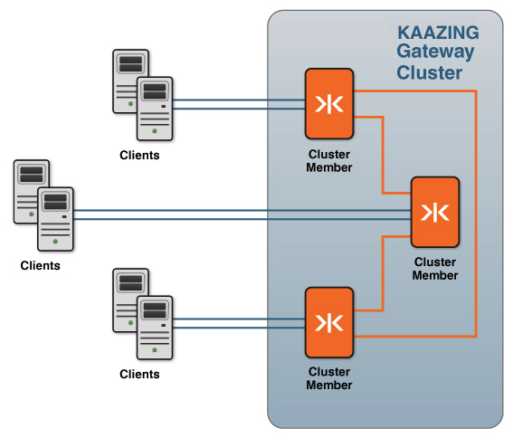
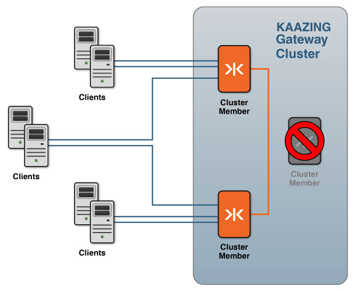

Using the Gateway to Support High Availability
================================================================================================

You can configure KAAZING Gateway to be highly available, something that is mission critical to the success of today's enterprises. Configuring KAAZING Gateway for high availability protects applications from hardware and software failures.

This document describes the various aspects of high availability configuration:

-   [Gateway Clustering](#gateway-clustering)
-   [Load Balancing Services](#load-balancing-services)
-   [Clustering and Load Balancing Migration](#clustering-and-load-balancing-migration)
-   [Configure a Two-Member Local Demo Cluster](#configure-a-two-member-local-demo-cluster)

To resolve issues encountered when configuring high availability, see [Troubleshoot KAAZING Gateway Clusters and Load Balancing](../troubleshooting/p_troubleshoot_high_availability.md).

Gateway Clustering
-------------------------------------------

High availability for services is achieved by configuring multiple gateways to be part of a cluster. Combining two or more Gateways in a cluster creates a single entity from the client's point of view. A clustered configuration is an essential part of hardware and software failover preparation.

### Overview of Gateway Clustering

You configure a cluster by adding the `cluster` configuration element to the `gateway-config.xml` file. In the `cluster` element, you add the address on which the Gateway instance is listening for other cluster members (typically, the local IP address of the Gateway) and the cluster group address used by all cluster members to discover other cluster members.

There is no concept of cluster masters and slaves; each cluster member has its own connection to the back-end server. If a cluster member terminates unexpectedly, the KAAZING Gateway client will reconnect to the cluster.

1.  The cluster members come online, discover the cluster members, and establish connections with the other cluster members. This is shown in the following figure (the back-end server is omitted):

    

    **Figure: Cluster Member Connections During Steady State**

2.  In the case when one of the cluster members terminates unexpectedly, then the KAAZING Gateway clients connected to that member will reconnect to the cluster and other members will no longer redirect to that cluster member. This is shown in the following figure:

    

    **Figure: Cluster Member Connections After a Failure**

3.  When the cluster member is brought back online, it starts participating again in the cluster as usual. Clustering is used in conjunction with load balancing (via the load balancing features of the Gateway or a third-party load balancer), which is described in the [Load Balancing Services](#load-balancing-services) section.

Load Balancing Services
--------------------------------------------------------

KAAZING Gateway provides the `balancer` service, which allows you to balance load for requests from any Gateway service type. Services running on KAAZING Gateway support peer load balancer awareness with the `balance` element.

All cluster members that wish to participate in load balancing are configured with a `balancer` service. Each member then acts as a *balancer Gateway* to the other members.

The load balancing process occurs as follows:

1.  An initial client request is sent to a Gateway configured with a `balancer` service (`ws://balancer.example.com:8081/echo`). The `balancer` service is aware of the services that have been configured for load balancing. The cluster members share information about which members are active and which services are balanced across the cluster.
2.  The `balancer` service checks the cluster to see which members are available, selects a member, and then sends a redirect to the client to connect to that member directly. 

    **Note**: The Gateway supports cookies. If the client has accessed a particular node before, the `balancer` service checks to see if that node is available; if the node is available, the `balancer` service chooses this node for the client connection. The `balancer` service follows the same process for terminated connections: if a connection terminates unexpectedly, the `balancer` service first checks to see if the node to which the client was originally connected is still available, and then tells the client to connect to that node.

3.  The client establishes a connection with the node assigned by the `balancer` service (for example, `ws://node1.example.com:8081/echo`), bypassing the first Gateway after the initial connection is established.
4.  If a connected KAAZING Gateway instance terminates unexpectedly, the client reconnects to the original Gateway URI (`ws://balancer.example.com:8081/echo`).
5.  The `balancer` service checks the cluster again to see which nodes are still available and chooses a new one for the client to connect to directly.
6.  The client establishes a connection with the new node assigned by the `balancer` service (for example, `ws://node2.example.com:8081/echo`), once again bypassing the first Gateway after the initial connection is established. 

    **Note**: The Gateways (members) of a KAAZING Gateway cluster share information across the cluster. If a connection or one of the Gateways fails, then a client can connect to another member within the cluster.

Clustering and Load Balancing Migration
-------------------------------------------------------------

The following checklists describe how to migrate a KAAZING Gateway 3.3-3.5 load-balanced cluster to KAAZING Gateway 4.x. The tasks in the checklists are a part of the overall Gateway configuration migration sequence described in the [Migrate the Gateway Configuration](../upgrade/p_migrate_gwconfig.md) topic. Before you migrate your existing cluster, review the procedures in [Configure the Gateway for High Availability](o_high_availability.md).

### Cluster Migration Checklist

| \#  | Step                                                                     | Description                                                                                                                                                                                                                                                                                                                                                                                                                                      |
|-----|--------------------------------------------------------------------------|--------------------------------------------------------------------------------------------------------------------------------------------------------------------------------------------------------------------------------------------------------------------------------------------------------------------------------------------------------------------------------------------------------------------------------------------------|
| 1   | Modify the `name` element in `cluster`, if desired.                      | In KAAZING Gateway 3.3-3.5, the `name` element was required to be `kzha`. This is no longer a requirement. The `name` element can be any name. The name must be the same in the `cluster` service of every Gateway that wishes to join this cluster.                                                                                                                                                                                 |
| 2   | Revise the `connect` element to contain a multicast address, if desired. | In KAAZING Gateway 3.3-3.5, at least one `connect` element containing the unicast address of another cluster member was required, but in KAAZING Gateway 4.x you can choose to use a multicast address in the `connect` element instead (for example, `udp://224.2.2.44:54327`). If you use a multicast address in the `connect` element, then the same `connect` element can be used in the `cluster` service on each cluster member. |

### Load Balancing Migration Checklist

| \#  | Step                                                                                                                                                                                                                | Description                                                                                                                                                                                                                                                                                                                                                                                                                                                                                                                                                                                                                                                                                                                                                                                                                                                                                                                                                                                                                                      |
|-----|---------------------------------------------------------------------------------------------------------------------------------------------------------------------------------------------------------------------|--------------------------------------------------------------------------------------------------------------------------------------------------------------------------------------------------------------------------------------------------------------------------------------------------------------------------------------------------------------------------------------------------------------------------------------------------------------------------------------------------------------------------------------------------------------------------------------------------------------------------------------------------------------------------------------------------------------------------------------------------------------------------------------------------------------------------------------------------------------------------------------------------------------------------------------------------------------------------------------------------------------------------------------------------|
| 1   | In the `balancer` service(s), add an `accept-options` element containing a `ws.bind` child element. In the `ws.bind` element, enter the local IP address of the cluster member.                                     | The `ws.bind` element in `accept-options` is used to bind the public URI in the `accept` element to the local IP address of this cluster member. This allows the `accept` URIs in the `balancer` service to be identical on every cluster member. Only the `ws.bind` element needs to be unique in each cluster member.                                                                                                                                                                                                                                                                                                                                                                                                                                                                                                                                                                                                                                                                                                                          |
| 2   | For each `service` participating in load balancing (each `service` element containing a `balance` element), ensure that the `balance` and `accept` element URIs in the `service` use the same port number and path. | The hostnames in the `balance` and `accept` element URIs may be different, but if the port number or path is different, an error will occur when the Gateway starts.                                                                                                                                                                                                                                                                                                                                                                                                                                                                                                                                                                                                                                                                                                                                                                                                                                                                          |
| 3   | Copy the `balancer` service to each cluster member.                                                                                                                                                                 | In KAAZING Gateway 3.3-3.5, there was the concept of a single Gateway running a `balancer` service on behalf of the other cluster members (a *balancer Gateway*). In KAAZING Gateway 4.x, every cluster member with a load-balanced service must include a `balancer` service.                                                                                                                                                                                                                                                                                                                                                                                                                                                                                                                                                                                                                                                                                                                                           |
| 4   | Configure DNS to support the load-balanced cluster members.                                                                                                                                                         | The hostname in the `accept` element of each `balancer` service must resolve in DNS to the IP addresses of every cluster member. Multiple DNS A resource records should be registered for the hostname in the `accept` URI, with each A record mapping the hostname to the IP address of one cluster member. When a client resolves the hostname of the `accept` URI in DNS, the client will receive the IP address of a cluster member and connect. To register these DNS records, you will need access to the public DNS zone for the hostname, or the assistance of your network administrator or Internet Service Provider (ISP). All ISPs provide ways for their customers to update their DNS zones with new hostnames and IP addresses. **Note:** During development and testing, you might choose to alter the [hosts](http://en.wikipedia.org/wiki/Hosts_(file)) file of the cluster members instead of registering DNS records. This is not recommended for production as it can complicate troubleshooting. |

Configure a Two-Member Local Demo Cluster
------------------------------------------------------------

The following steps walk you through setting up a two-member cluster with load-balanced services on your local server. The local cluster will help you learn about setting up, monitoring, and managing a cluster without having to use multiple servers.

1.  Set up name resolution for the local cluster.
    1.  Open the hosts file on your computer. For information on the location of the hosts file on your operating system, see [hosts (file)](http://en.wikipedia.org/wiki/Hosts_(file)#Location_in_the_file_system) on Wikipedia.
    2.  Add the following entries to the hosts file:

        ``` xml
        172.19.19.4   example.com
        172.19.19.5   example.com

        172.19.19.4   member1.example.com
        172.19.19.5   member2.example.com
        ```

        The entries for `example.com` are the balance URI domain name and IP addresses. The remaining entries are for the individual cluster members.

    3.  Save the hosts file.

2.  Set up the local virtual network. Run the following commands to set up the local virtual network.

    The network interface syntax might need to change depending on the active interfaces on your server. For example, if you are on a Mac and have the interface `en1` active, you can use `en1 alias` in the commands below. To see the active interfaces, on Linux and Mac, use the command `ifconfig -a`. On Windows, use `netsh interface ipv4 show interfaces`.

    -   Determine which active interface to use for the virtual interface. On Linux and Mac, use the command `ifconfig -a`. On Windows, use `netsh interface ipv4 show interfaces`. Active interfaces will have `status: active` in their description. Choose an active interface, and substitute its name for `eth0` (Linux), `en1` (Mac) or `Local Area Connection` (Windows) in the commands below, if necessary.
    -   For Linux, run each of the following commands:

        `sudo ifconfig eth0:1 172.19.19.4`

        `sudo ifconfig eth0:2 172.19.19.5`

        Set the default gateway with `route add default gw 172.16.120.2`.

        Your `ifconfig -a` output should now contain entries for each new subinterface:

        ```
        eth0 Link encap:Ethernet HWaddr 5c:26:0a:14:ef:49
         ...
         eth0:1 Link encap:Ethernet HWaddr 5c:26:0a:14:ef:49
         inet addr:172.19.19.4 Bcast:172.19.255.255 Mask:255.255.0.0
         ...
         eth0:2 Link encap:Ethernet HWaddr 5c:26:0a:14:ef:49
         inet addr:172.19.19.5 Bcast:172.19.255.255 Mask:255.255.0.0
         ...
         ```

        **Note:** To remove these temporary aliases, use the `down` command, for example: `sudo ifconfig eth0:1 down`

    -   For Mac, perform the following steps:

        1.  Open **System Preferences**.
        2.  Click **Network**.
        3.  At the bottom of the list of interfaces, click **+**.
        4.  In **Interface**, select an active interface such as your Ethernet interface.
        5.  In **Service Name**, enter **Ethernet 1.1**.
        6.  Click **Create**.
        7.  Select the new interface and click **Advanced**.
        8.  Click the **TCP/IP** tab.
        9.  In **Configure IPv4**, select **Manually**.
        10. In **IPv4 Address**, enter 172.19.19.4.
        11. In **Subnet Mask**, enter 255.255.0.0.
        12. In **Router**, enter your router's address, such as 198.162.0.1. You can obtain this address from your main Ethernet interface settings.
        13. Click **OK**.
        14. Click **Apply**.
        15. Repeat these steps for the second alias, using the **Service Name** `Ethernet 1.2` and the **IPv4 Address** `172.19.19.5`.

        Your `ifconfig -a` output should now contain entries for each new subinterface:

        ```
        en1: flags=8863<up,broadcast,smart,running,simplex,multicast> mtu 1500
         ether 68:a8:6d:1f:27:94
         inet6 fe80::6aa8:6dff:fe1f:2794%en1 prefixlen 64 scopeid 0x6
         inet 192.168.0.102 netmask 0xffffff00 broadcast 192.168.0.255
         inet 172.19.19.4 netmask 0xffff0000 broadcast 172.19.255.255
         inet 172.19.19.5 netmask 0xffff0000 broadcast 172.19.255.255
         media: autoselect
         status: active
         ```

    -   For Windows, run each of the following commands (this configuration can also be performed using the **Advanced TCP/IP Settings** dialog in Windows):

        `netsh interface ipv4 set address name="Local Area Connection" source=static addr=172.19.19.4 mask=255.255.255.0 gateway=172.16.120.2`

        `netsh interface ipv4 set address name="Local Area Connection" source=static addr=172.19.19.5 mask=255.255.255.0 gateway=172.16.120.2`

        Your `ipconfig /all` output should now contain entries for each new subinterface:

        ```
        Ethernet adapter Local Area Connection:
         Connection-specific DNS Suffix . :
         Description . . . . . . . . . . . : Intel(R) PRO/1000 MT Network Connection
         Physical Address. . . . . . . . . : 00-0C-29-5F-27-49
         DHCP Enabled. . . . . . . . . . . : No
         Autoconfiguration Enabled . . . . : Yes
         Link-local IPv6 Address . . . . . : fe80::a848:ad83:8d6e:a393%11(Preferred)
         IPv4 Address. . . . . . . . . . . : 172.16.120.128(Preferred)
         Subnet Mask . . . . . . . . . . . : 255.255.0.0
         IPv4 Address. . . . . . . . . . . : 172.19.19.4(Preferred)
         Subnet Mask . . . . . . . . . . . : 255.255.0.0
         IPv4 Address. . . . . . . . . . . : 172.19.19.5(Preferred)
         Subnet Mask . . . . . . . . . . . : 255.255.0.0
         Default Gateway . . . . . . . . . : 172.16.120.2
         DHCPv6 IAID . . . . . . . . . . . : 234884137
         DHCPv6 Client DUID. . . . . . . . : 00-01-00-01-17-B1-FC-61-00-0C-29-5F-27-49
         DNS Servers . . . . . . . . . . . : 172.16.120.2
         NetBIOS over Tcpip. . . . . . . . : Enabled
         ```

        **Note:** To remove these temporary aliases, use the `delete` command, for example: `netsh in ip delete address "Local Area Connection" 172.19.19.4`

3.  Configure the configuration files for the cluster members.

    1.  Copy the following configuration files from the `GATEWAY_HOME/web/extras/samples/cluster` folder:

        -   cluster-member-1-config.xml
        -   cluster-member-2-config.xml

    2.  Paste the configuration files into `GATEWAY_HOME/conf` folder.

4.  Navigate to `GATEWAY_HOME/bin`, and launch the first cluster member using the following command, where `GATEWAY_HOME` is the full path to the directory that contains KAAZING Gateway and its components (for more information, see [Setting Up the Gateway](../about/setup-guide.md)):

    -   For Mac and Linux:

        `./gateway.start --config *GATEWAY\_HOME*/conf/cluster-member-1-config.xml`

    -   For Windows:

        `gateway.start.bat --config *GATEWAY\_HOME*\\conf\\cluster-member-1-config.xml`

5.  From `GATEWAY_HOME/bin`, launch the second cluster member using the following command:
    -   For Mac and Linux:

        ./gateway.start --config *GATEWAY\_HOME*/conf/cluster-member-2-config.xml

    -   For Windows:

        gateway.start.bat --config *GATEWAY\_HOME*\\conf\\cluster-member-2-config.xml

        Once the second cluster member is running, the output in the command line for the first cluster member will read:

        ```
        Members [2] {
         Member [172.19.19.4:5942] this
         Member [172.19.19.5:5943]
         }
         INFO Cluster member tcp://172.19.19.5:5943 is now online
         ```

6.  Run Command Center to view the cluster. For information on running Command Center, see [Monitor with Command Center](../management/p_monitor_cc.md).

    1.  Open a Web browser and enter the following URL: `http://example.com:8000/commandcenter`.
    2.  In **Management URL**, enter `ws://member1.example.com:8000/snmp`.
    3.  Enter the username and password and click **OK**. The default passwords are stored in `GATEWAY_HOME/conf/jaas-config.xml`

    The Command Center dashboard displays the message **Connected to a cluster. Members: 2**. You can use the Command Center to view details about the cluster.

7.  In a new Web browser tab, enter the following URL: `http://example.com:8001/`.
8.  Click the **Demos** link and run some of the demos against the cluster. Then return to Command Center to monitor how the cluster manages client connections.

See Also
------------------------------

-   [Configure the Gateway for High Availability](o_high_availability.md)
    -   [Configure a KAAZING Gateway Cluster](p_high_availability_cluster.md)
    -   [Set Up KAAZING Gateway as a Load Balancer](p_high_availability_loadbalance.md)
    -   [Troubleshoot KAAZING Gateway Clusters and Load Balancing](../troubleshooting/p_troubleshoot_high_availability.md)
