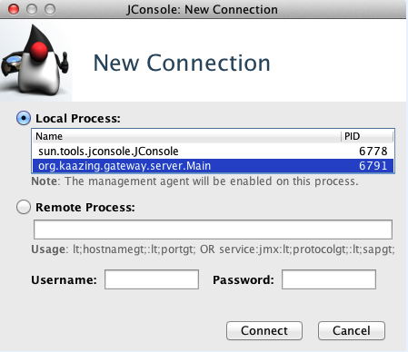
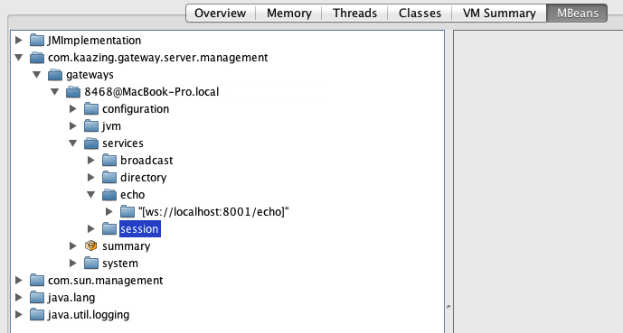
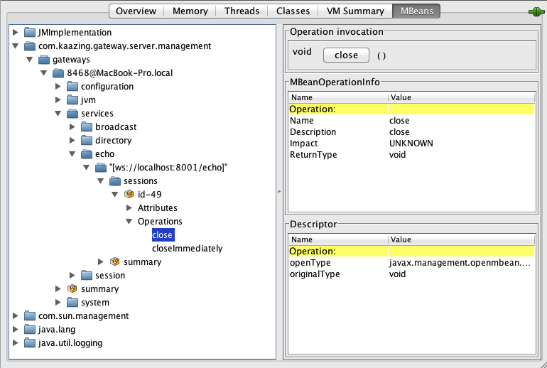
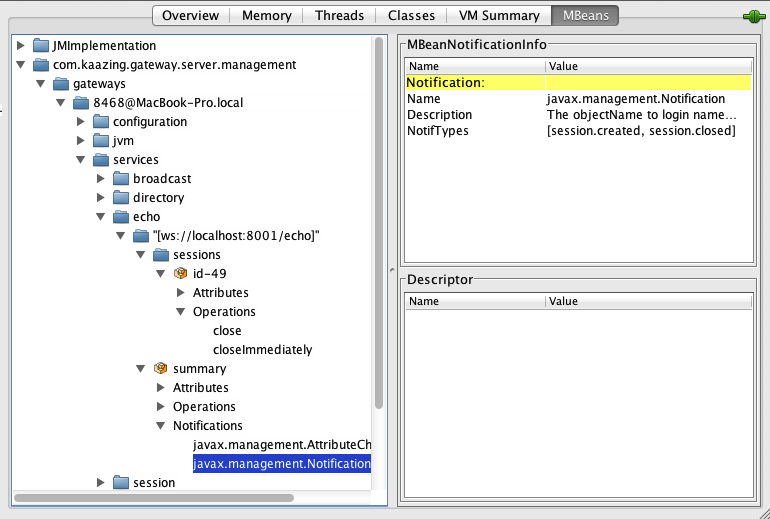

Monitor with JMX
===============================================================

KAAZING Gateway supports Java Management Extension (JMX) access through any JMX-compliant console, such as Java's built-in Java Management and Monitoring Console ([JConsole](http://docs.oracle.com/javase/7/docs/technotes/guides/management/jconsole.html "Using JConsole - Java SE Monitoring and Management Guide")) or MC4J, or through any program that supports communication using the JMX protocol. The Gateway supports a `management.jmx` service to allow JMX-compliant applications to monitor current Gateway service and session state and operate on individual sessions. See the [Service Reference](../admin-reference/r_configure_gateway_service.md) for information about the JMX management service (`management.jmx`).

Before You Begin
----------------

This procedure is part of [Monitor the Gateway](o_monitor.md):

1. [Introduction to Monitoring KAAZING Gateway](o_monitor.md#introduction-to-monitoring-kaazing-gateway)
2. [Secure KAAZING Gateway Monitoring](p_monitor_configure_secure.md)
3. Monitor a Gateway or Gateway cluster
    -   [Monitor with Command Center](p_monitor_cc.md) (**Recommended**)
    -   **Monitor with JMX**
4. [Troubleshoot the Gateway](../troubleshooting/o_troubleshoot.md)

To Monitor with JMX
-------------------

1.  Install and start the Gateway as described in [Setting Up the Gateway](../about/setup-guide.md). 

    **Note:** To connect to a JMX service on a Gateway running on an EC2 instance, configure the `GATEWAY_OPTS` environment variable with the `-Djava.rmi.server.hostname` property set to the IP address or hostname being used in the RMI registry. For example, `GATEWAY_OPTS="-Xmx512m -Djava.rmi.server.hostname=ec2-54-205-184-88.example-1.amazonaws.com`. See the topic [Configure KAAZING Gateway Using the GATEWAY\_OPTS Environment Variable](../admin-reference/p_configure_gateway_opts.md) for more information.
	
2.  Ensure secure monitoring by verifying that your configuration specifies a security realm name and an authorization constraint. This is set up automatically if you use the default Gateway configuration. See [Secure KAAZING Gateway Monitoring](p_monitor_configure_secure.md) for more information.
3.  Start your favorite Java monitoring console or application. This documentation uses JConsole for its examples.
4.  Select the local process, for example `org.kaazing.gateway.server.Main` (as shown in the following screenshot), then click **Connect**. (For Windows, the local process name is `org.kaazing.gateway.server.WindowsMain`.)

    

    **Figure: Monitoring the Local Process with JConsole**

    **Notes:**

    -   To connect to a *remote* process you must specify an address that uniquely represents the remote instance of the Gateway and provide the administrator's user name and password (by default, `admin`/`admin`). If there are multiple instances of the Gateway on a remote server then JMX management is hosted on different ports.
    -   Use the following syntax to access your local Gateway as a remote process (where `hostname` is the remote hostname): `service:jmx:rmi://hostname/jndi/rmi://hostname:2020/jmxrmi`
    -   Password authentication over the Secure Sockets Layer (SSL) and Transport Layer Security (TLS) is enabled by default in JMX. Consequently, you must have a digital certificate for the hostname of the Gateway in the keystore.db file used by the Gateway. In addition, access to port 2020 must be enabled in your network for the remote monitoring agent to connect to the Gateway. For information on how to create a certificate for the hostname of the Gateway, see [Secure Network Traffic with the Gateway](../security/o_tls.md).

5.  JConsole displays information about the particular JVM process you just clicked on or entered.
6.  Click the **MBeans** tab.
7.  Expand the service that you want to monitor.

    For example, the following JConsole screenshot shows an expanded `org.kaazing.gateway.server.management` \> `service` and expanded the `echo` node.

    

    **Figure: Viewing the Echo Service in JConsole**

8.  Click one of the session IDs. The session data exposed by the MBeans displays. Here, you can examine the user sessions on the Gateway.

Get Started with JMX Monitoring
--------------------------------------------------------------

The steps in this section use the JConsole example from the previous section to demonstrate the procedure.

### To Examine Available Sessions:

1.  Click the service that you want to examine.

    For example, in our running JConsole example, you would click the **Echo** service, as this is the service being used by the demo you started.

2.  Expand the connection.
3.  Expand the sessions node to view the session IDs.
4.  Select the session ID you want to manage. The following screenshot shows that you can manually manage the session, such as using the `close()` or the `closeImmediately` operation, to explicitly close the specific session:

    

    **Figure: Subscribing to a Session in JConsole**

5.  To subscribe to notifications in the console, expand the **summary** section, click **Notifications**, then click **javax.management.Notification**, as shown in the following screenshot:

    

    **Figure: Subscribing to Notifications in JConsole**

6.  Now that you've taken a look at some of the actions you can perform on a session, you can use this information with your own management console to manage user sessions. The Gateway also tracks the information you see here, such as the opening and closing of sessions, and sends this information by way of JMX notifications. You can then set up your JMX clients to subscribe to these notifications or query the sessions directly from the JMX server bean. To learn how to do this, see the next section, [To Configure Notifications](#to-configure-notifications).

To Configure Notifications
------------------------------------------------------------------------

The Gateway tracks sessions that are opened and closed in the management interface and sends out JMX notifications. You can configure a JMX client to subscribe to these notifications or configure the Gateway to query the connected sessions. The JMX notification includes the user's data, which consists of a key and a value.

You can also configure the Gateway to extract user information from the authentication information within the session. For example, in the security section of the `gateway-config.xml` file, you can use the `user-principal-class` property, as shown in the following example.

``` xml
<security>
    <realm>
        <name>demo</name>
        <user-principal-class>
            org.kaazing.gateway.server.auth.config.parse.DefaultUserConfig
        </user-principal-class>
        <user-principal-class>
            org.kaazing.gateway.server.auth.gss.GssSourcePrincipal
        </user-principal-class>
        <user-principal-class>
            org.kaazing.gateway.server.auth.gss.GssTargetPrincipal
        </user-principal-class>
    </realm>
</security>
```

After you add the `userPrincipalClass` property to the [realm](../admin-reference/r_configure_gateway_security.md#realm), save the `gateway-config.xml` file and start the Gateway. You should then see notifications in JConsole of one of two types: `session.created` or `session.closed`.

Next Step
---------

You have configured management with JMX for KAAZING Gateway.

See Also
--------

-   The [realm](../admin-reference/r_configure_gateway_security.md#realm) element for reference information about the `user-principal-class` property.
-   KAAZING Gateway [documentation](../index.md) for more information about Gateway administration.