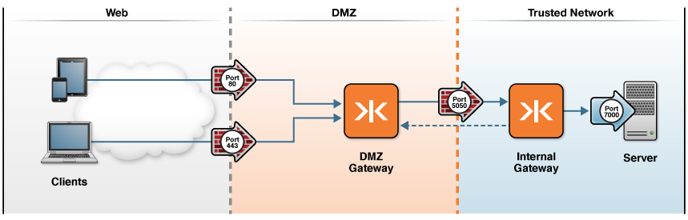

-   [Home](../../index.md)
-   [Documentation](../index.md)
-   Configure ${enterprise.shield} with ${the.gateway}

Configure ${enterprise.shield} with ${the.gateway}${enterprise.logo}${enterprise.logo.jms}
==========================================================================================

This checklist provides the steps necessary to configure ${enterprise.shield} in your ${gateway.name.short} architecture.

| \#  | Step                                                              | Topic or Reference                                                                                        |
|-----|-------------------------------------------------------------------|-----------------------------------------------------------------------------------------------------------|
| 1   | Become familiar with the DMZ-to-trusted network Gateway topology. | [Common ${gateway.name.long} Production Topologies](../admin-reference/c_topologies.md#DMZ_to_Internal) |
| 2   | Understand what ${enterprise.shield} is and how it works.         | [About ${enterprise.shield}](#whatis)                                                                     |
| 3   | Set up a basic ${gateway.name.long} configuration.                | ${setting.up.inline}                                                                                      |
| 4   | Configure ${enterprise.shield}.                                   | [Configure ${enterprise.shield}](p_rc_config.md)                                                        |
| 5   | Configure ${enterprise.shield} in a cluster.                      | [Configure ${enterprise.shield} in a Cluster](p_rc_cluster.md)                                          |

About ${enterprise.shield}
-----------------------------------------------

${enterprise.shield} protects your trusted network by initiating the connection from the internal trusted network towards the DMZ. Until now, allowing access to an trusted network while still maintaining security behind the firewall has been impossible because of the necessity to open ports to accept incoming connections. For most administrators, opening a port to the outside world is a necessary but undesirable solution because it instantly increases vulnerability to outside hacks and attacks. Companies are reluctant to open up ports in firewalls because each open port is another potential attack vector for malicious users. Using ${enterprise.shield}, you can close all of your inbound ports while still allowing clients to initiate connections.

Traditionally, web architectures require that you open inbound ports to allow connectivity to internal systems and services in your trusted network. As with any web architecture, a typical ${gateway.name.long} configuration (without ${enterprise.shield}) must open ports to allow TCP, HTTP, or WebSocket connectivity through a firewall, as shown in the following figure:

<figure style="margin-left:0px;">

<figcaption>
**Figure 1: A ${gateway.name.long} Topology with Ports Open to the Trusted Network**
</figcaption>
</figure>
Using ${enterprise.shield}, you can close all inbound ports in your firewall, thus closing the entry points available to untrusted users and eliminating your attack surface vulnerability.

To implement ${enterprise.shield}, you configure an additional Gateway in the DMZ, which receives a reverse connection from within the trusted network. With this architecture, a client can talk to the ${message.broker.generic} through a firewall. Another benefit of ${enterprise.shield} is that your architecture remains valid, without requiring changes. For example, neither the client nor the ${message.broker.generic} are aware of the reverse connection because it is completely transparent to the rest of the architecture. Clients that are outside the firewall connect as usual to the DMZ Gateway.

<figure style="margin-left:0px;">

<figcaption>
**Figure 2: Closed Inbound Ports in an ${enterprise.shield} Topology**
</figcaption>
</figure>
Adding ${enterprise.shield} to your architecture requires only a few simple modifications. Instead of a single Gateway in the DMZ, you add another Gateway to your trusted network. Then, you only need to make a few changes to the two Gateway configurations to reverse the connection. Other parts of the architecture, such as the client and the ${message.broker.generic}, observe no apparent differences between a configuration with ${enterprise.shield} or one without, making the reverse connection completely transparent to the endpoints of the configuration.

With this architecture in place, you can close all inbound ports of your firewall, thus providing maximum security and zero attack vectors for malicious users seeking to exploit ports in your firewall.

[Configure ${enterprise.shield}](p_rc_config.md) describes how to configure ${gateway.name.long} to protect your enterprise by using a reverse connection to initiate the connection from ${the.gateway} in the internal trusted network to a DMZ Gateway.

**Note:** Before you configure ${enterprise.shield} you should have a basic understanding of the following topologies: 
-   Standard Gateway topology:

    The recommended Gateway topology has two Gateway instances connecting a client and the ${message.broker.generic} through two layers of network security: a firewall-protected DMZ Gateway and a firewall-protected internal Gateway. See [DMZ Gateway to Trusted Network Topology](../admin-reference/c_topologies.md#DMZ_to_Internal) for more information.

-   Forward and reverse connections (proxies):
    -   A forward connection (forward proxy) that uses the SOCKet Secure (SOCKS) protocol and initiates a TCP, HTTP, or WS connection from a DMZ Gateway to a Gateway on the trusted network through firewalls. Configuring a forward connection is an important step to ensuring ${the.gateway} settings are correctly set up before you attempt to reverse the connection.
    -   A reverse connection (reverse proxy) that retrieves resources on behalf of a client from one or more servers to allow communication between the client and the ${message.broker.generic} that is otherwise blocked by the firewall. Reverse connections can hide the existence and characteristics of servers such that clients making requests connect to the proxy but remain unaware of the trusted network. These resources are then returned to the client as though they originated from the ${message.broker.generic}.

