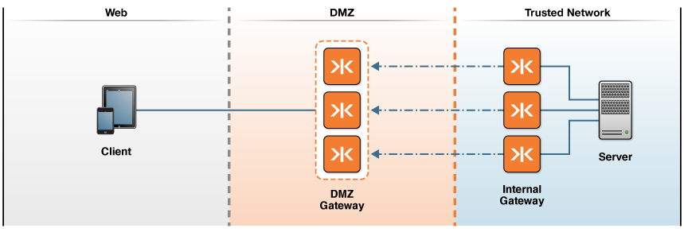

-   [Home](../../index.md)
-   [Documentation](../index.md)
-   Configure ${enterprise.shield} in a Cluster?

Configure ${enterprise.shield} in a Cluster${enterprise.logo}${enterprise.logo.jms}
===================================================================================

To add ${enterprise.shield} to your cluster configuration, you can start out by following the guidelines described in the [Configure ${enterprise.shield}](p_rc_config.md) topic. After that, the key is to configure ${enterprise.shield} on each cluster member, and create an equivalent number of cluster members on the DMZ and the trusted network.

In Figure 1, there are three Gateways running in the DMZ and a matching set of three Gateways on the trusted network. Thus, each internal Gateway is paired to one explicit cluster member in the DMZ.

<figure style="margin-left:0px;">

<figcaption>
**Figure 1: Gateway Topology Configured for ${enterprise.shield} in a Cluster**
</figcaption>
</figure>
Note that ${enterprise.shield} does not affect the behavior of the cluster in any way. Clients initiate requests in the same way and are unaware that the cluster is configured for reverse connectivity. You connect with a client in the same way as you would for a cluster without ${enterprise.shield}.

The recommended method of setting up ${enterprise.shield} in a cluster is as follows:

-   Configure a reverse connection on each cluster member.</a>
-   Use pairing (or coupling) to match up each cluster member on the DMZ with a cluster member on the trusted network.

    To pair cluster members you configure the HTTP transport identically on the internal Gateway and DMZ Gateway. For example, to configure the six ${gateway.cap}s shown in Figure 1:

    **Gateway Cluster Pair 1**

    On the first DMZ Gateway, configure the `connect-options` as follows:

    ``` auto-links:
               <http.transport>
                 socks+ssl://gateway1.dmz.net:1080
               </http.transport>
    ```

    On the first internal Gateway, configure the `accept-options` as follows:

    ``` auto-links:
               <http.transport>
                 socks+ssl://gateway1.dmz.net:1080
               </http.transport>
    ```

    **Gateway Cluster Pair 2**

    On the second DMZ Gateway, configure the `connect-options` as follows:

    ``` auto-links:
               <http.transport>
                 socks+ssl://gateway2.dmz.net:1080
               </http.transport>
    ```

    On the second internal Gateway, configure the `accept-options` as follows:

    ``` auto-links:
               <http.transport>
                 socks+ssl://gateway2.dmz.net:1080
               </http.transport>
    ```

    **Gateway Cluster Pair 3**

    On the third DMZ Gateway, configure the `connect-options` as follows:

    ``` auto-links:
               <http.transport>
                 socks+ssl://gateway3.dmz.net:1080
               </http.transport>
    ```

    On the third internal Gateway, configure the `accept-options` as follows:

    ``` auto-links:
               <http.transport>
                 socks+ssl://gateway3.dmz.net:1080
               </http.transport>
    ```

See Also
--------

-   [About ${enterprise.shield}](o_rc_checklist.md#whatis)
-   [Configure ${enterprise.shield}](p_rc_config.md)
-   [Configure ${the.gateway} for High Availability](../high-availability/o_ha.md)
-   [Cluster Reference](../admin-reference/r_conf_cluster.md)


