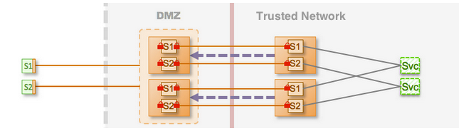

-   [Home](../../index.md)
-   [Documentation](../index.md)
-   Security with KAAZING Gateway

Walkthrough: Configure Enterprise Shield™ for High Availability 
=================================================================

This step extends the use case to configure an Enterprise Shield™ configuration described in [Walkthrough: Configure Enterprise Shield™](p_rc_config.md) into a cluster configuration that has two Gateways running in the DMZ and a matching set of Gateways in the trusted network. This configuration provides maximum security and also high availability because it pairs each internal Gateway to one explicit cluster member in the DMZ to provide failover (system resilience) during hardware or network failures. The complete configuration files for the cluster are available on `kaazing.org` at `enterprise-shield-use-case-3-cluster.xml`.

**Note:** Enterprise Shield™ does not affect the behavior of the cluster in any way. Clients initiate requests in the same way and are unaware that the cluster is configured for reverse connectivity. You connect with a client in the same way as you would for a cluster without Enterprise Shield™.

In Figure 1, there are two Gateways running in the DMZ and a matching set of two Gateways on the trusted network. Thus, each internal Gateway is paired to one explicit cluster member in the DMZ.

<figure style="margin-left:0px;">

<figcaption>
**Figure 1: Enterprise Shield™ Topology Configured for High Availability**
</figcaption>
</figure>
The key to making the Enterprise Shield™ configuration highly available is to configure clustering on each cluster member, and have an equivalent number of cluster members in the DMZ and the trusted network.

The following steps provide a high-level overview about cluster configuration. See [Configure a KAAZING Gateway Cluster](../high-availability/p_ha_cluster.md) for detailed information about cluster configuration and the [cluster](../admin-reference/r_conf_cluster.md) element.

-   Update the properties element to use a numbered value for the DMZ backplane variable---such as `gateway1`---to provide a unique name for the Gateway cluster pair:

    **Internal Gateway**

    ``` auto-links:
    <properties>

      <!-- The Gateway in the DMZ to connect to. -->
      <property>
        <name>dmz.cluster.backplane.hostname</name>
        <value>gateway1.example.dmz.net</value>
      </property>

    </properties>
    ```

    **DMZ Gateway**

    ``` auto-links:
    <properties>
      <!-- The IP address of this cluster member. -->
      <property>
        <name>gateway.ip.address</name>
        <value>172.19.20.1</value>
      </property>

      <!-- The port number (value) must be different for each member. -->
      <property>
        <name>cluster.port</name>
        <value>5941</value>
      </property>

      <!-- The publicly addressable hostname. -->
      <property>
        <name>dmz.cluster.frontplane.hostname</name>
        <value>gateway1.example.com</value>
      </property>

      <!-- The private address that the internal gateway connects to. -->
      <property>
        <name>dmz.cluster.backplane.hostname</name>
         <value>gateway1.example.dmz.net</value>
      </property>

    </properties>
    ```

-   On the DMZ Gateway, add the cluster element:

    ``` auto-links:
    <cluster>
      <name>tcp://${gateway.ip.address}:${cluster.port}</name>
      <accept>172.19.20.1</accept>
      <connect>udp://224.2.2.44:44444</connect>
    </cluster>
    ```

    The accept element contains the URI on which the cluster member listens for other cluster members. The connect element contains the URI used to discover other cluster members. In this case, it uses a multicast address.

-   On the DMZ Gateway, add a balancer service for each service. The following example shows the balancer service for DMZ App1:

    ``` auto-links:
    <service>

      <name>Balancer for DMZ App1</name>
      <accept>wss://gateway.example.com:8443/app1</accept>

      <type>balancer</type>

      <accept-options>
        <tcp.bind>${gateway.ip.address}:8443</tcp.bind>
      </accept-options>

      <cross-site-constraint>
        <allow-origin>*</allow-origin>
      </cross-site-constraint>

    </service>
    ```

    To configure a balancer service for DMZ App2, duplicate this block of configuration elements and substitute App2 and app2 in the name and accept elements.

    The `tcp.bind` element in the `accept-options` binds the public URI in the accept element to the local IP address of the cluster member. Because `tcp.bind` contains the local IP address of that cluster member, it allows the accept URIs in the balancer service to be identical on every cluster member. For more information, see [protocol.bind and](../admin-reference/r_conf_service.md#protocolbind)[Set Up Kaazing WebSocket Gateway as a Load Balancer](../high-availability/p_ha_loadbalance.md).

-   On the DMZ Gateway, add a balance element for each service, specifying the URI accepted by the balancer service. Clients then use these URIs to connect to the service.

    **For App1, add:**

    ``` auto-links:
    <balance>wss://gateway.example.com:8443/app1</balance>
    ```

    **For App2, add:**

    ``` auto-links:
    <balance>wss://gateway.example.com:8443/app2</balance>
    ```

-   Start each Gateway and verify the cluster is running.
-   Repeat these steps for each cluster pair you want to add to the Enterprise Shield™ topology.

    Remember to use unique hostnames, IP addresses, and ports for each cluster pair. For example, for Gateway Cluster Pair 2 you might use `gateway2.example.dmz.net`, and for Gateway Cluster Pair 3 use `gateway3.example.dmz.net`.

The complete configuration files for all of the Enterprise Shield™ Use Cases are located on `kaazing.org`.

See Also
--------

-   [About KAAZING Gateway Configuration](../admin-reference/c_conf_concepts.md)
-   [Service Reference](../admin-reference/r_conf_service.md)
-   [Cluster Reference](../admin-reference/r_conf_cluster.md)
