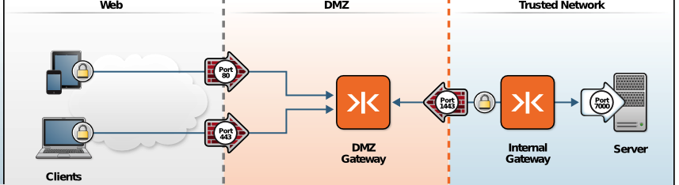

-   [Home](../../index.md)
-   [Documentation](../index.md)
-   Configure Enterprise Shield&trade;

Configure Enterprise Shield&trade; 
======================================================================

In this procedure you will learn how to configure Enterprise Shield&trade; for KAAZING Gateway to allow a connection from the DMZ to the trusted network without the need to open any inbound firewall ports. By configuring Enterprise Shield&trade;, you can close all externally facing ports entirely, providing maximum security and zero attack vectors for malicious users seeking to exploit ports in your firewall.

Before you get started with configuration tasks, it is important to understand the concepts behind Enterprise Shield&trade; by reading the topics in [About Enterprise Shield&trade;](o_rc_checklist.md#about-enterprise-shield) and to have a basic understanding of common Gateway topologies, as described in [DMZ Gateway to Trusted Network Topology](../admin-reference/c_topologies.md#dmz-to-trusted-network-topology).

The procedure in this topic creates a topology similar to the following figure.


**Figure: Enterprise Shield&trade; Topology**

In the figure, the client needs to communicate with the back-end service or message broker located on a trusted network, but the client is not authorized to communicate through the firewall. In the Enterprise Shield&trade; topology, interactions between the client, the DMZ Gateway and internal Gateway, and the back-end service or message broker on a trusted network occur as described in the following list:

1.  The internal Gateway in the trusted network accepts connections for the proxy service to the back-end service or message broker, as usual. However because it is configured for a *reverse* connection, the `accept` does not listen for incoming connections as usual, but rather initiates a connection—remember that it's reversed! **Note:** Normally an `accept` element in a service definition instructs the internal Gateway to listen on the port for incoming connections. However, with Enterprise Shield&trade;, instead of listening, the internal Gateway initiates a reverse connection to the DMZ Gateway. The reverse connection is achieved by configuring the internal Gateway service to act as a SOCKS client, sending remote bind requests to the DMZ Gateway. This tells the remote side to listen for connections on a particular host and port. That way, when clients' connection requests come in to the DMZ Gateway, the Gateway matches them up with SOCKS bind requests.
2.  The DMZ Gateway starts to connect to the internal Gateway. Typically, the `connect` initiates a connection but because this is configured to be in *reverse* the DMZ Gateway listens for connections from the internal Gateway. **Note:** Normally a `connect` element in a service definition instructs the DMZ Gateway to establish an outgoing physical network connection to the specified URI on a remote host machine for each client as it connects to the service. However, with a reverse connection, instead of connecting, the DMZ Gateway listens for an incoming bind request from the internal Gateway. If a bind request matching the specified connect URI is received, then a reverse connection is formed. The reverse connection is achieved by configuring the DMZ Gateway service to act as a SOCKS server, receiving remote bind requests from the internal Gateway.
3.  A client initiates a request to the back-end service or message broker.
4.  After the client connects to the DMZ Gateway, a full-duplex connection between the client and the back-end service or message broker is established through the DMZ and internal Gateways.

    When the DMZ Gateway receives an inbound request, an end-to-end logical connection from the client to the back-end service or message broker is in place, and the application functions as usual. The only difference to the back-end service or message broker is that its connection comes from the internal Gateway rather than directly from the DMZ Gateway.

The configuration for Enterprise Shield&trade; is virtually transparent to other areas in your architecture. The end points—the client and the back-end service or message broker—remain unchanged and are even unaware that the connection is reversed between the DMZ and internal Gateways. After you add a second Gateway, the only change to your existing architectural components is a minor configuration change on the DMZ Gateway, adding the internal Gateway, and closing the inbound ports in your firewall.

Before You Begin
----------------

This procedure is part of [Configure Enterprise Shield&trade; with the Gateway](o_rc_checklist.md)

1.  Become familiar with the [DMZ-to-trusted network Gateway topology](../admin-reference/c_topologies.md#)
2.  [About Enterprise Shield&trade;](o_rc_checklist.md#about-enterprise-shield)
3.  **Configure Enterprise Shield&trade;**
4.  [Configure Enterprise Shield in a Cluster](p_rc_cluster.md)

To Configure Enterprise Shield&trade;
---------------------------------

To configure Enterprise Shield&trade;, you set up the internal Gateway and DMZ Gateway configurations to use the SOCKet Secure (SOCKS) protocol and set the other configuration elements as described for each Gateway in the following procedure.

**Note:** The following examples use the .net domain (for example, `tcp://broker.internal.net:1080`) to indicate internal, nonpublic URLs, and use the .com domain to indicate public URLs. All domains and URLs are for example purposes only.
### <a name="Step1"></a>Configure the Internal Gateway

The following procedure walks you through the steps to configure the internal Gateway for Enterprise Shield&trade;. See [Configuration Examples](#configuration-examples) for a snapshot of the completed service configuration.

1.  Set up a secure connection in the `accept` element by using WebSocket Secure and port 443, for example: `<accept>wss://gateway.example.com:443/path</accept>`
    The public URI `wss://gateway.example.com:443/path` is configured to accept a connection from the client. In subsequent steps you will see that this URI is used again to configure a logical connection through the DMZ Gateway and to the internal Gateway. **Note:** Once you configure a secure connection on one Gateway then you must configure every Gateway (including every member in a Gateway cluster) in the same fashion to achieve secure end-to-end connectivity.
2.  Connect to the back-end service or message broker by configuring the `connect` element using the URI for the back-end service or message broker. For example: `<connect>tcp://internal.example.com:1080</connect>`

    The example uses port 1080, which is commonly used, but not required. See [About Ports](../about/about.md#about-ports) for a list of commonly used ports.

3.  Connect the internal Gateway to a back-end service or message broker by adding `properties` that name the ConnectionFactory, describe the format for queue and topic names, and provide the URI for the JMS-compliant message broker. For example:

    ``` xml
          <properties>
            <connection.factory.name>
              ConnectionFactory
            </connection.factory.name>
            <context.lookup.topic.format>
              dynamicTopics/%s
            </context.lookup.topic.format>
            <context.lookup.queue.format>
              dynamicQueues/%s
            </context.lookup.queue.format>
            <env.java.naming.factory.initial>
              org.apache.activemq.jndi.ActiveMQInitialContextFactory
            </env.java.naming.factory.initial>
            <env.java.naming.provider.url>
              tcp://internal.example.com:port-number
            </env.java.naming.provider.url>
          </properties>
    ```

    The internal Gateway connects to the back-end service or message broker using `tcp://broker.internal.net:port-number`.

4.  Add the following [`accept-options`](../admin-reference/r_conf_service.md#accept-options-and-connect-options):
    -   Set the HTTP transport to use SOCKS+SSL (recommended) or SOCKS protocol, for example: `<http.transport>socks+ssl://gateway.dmz.net:1080</http.transport>`

        Enterprise Shield&trade; requires that you use a transport option (`http.transport` for WebSocket connections) using SOCKS or SOCKS+SSL protocol to establish the network connections from the DMZ Gateway to the internal Gateway at the center of the Enterprise.

    -   Specify the [`socks.mode`](../admin-reference/r_conf_service.md#socksmode) option in reverse mode so the internal Gateway listens for connections from the DMZ Gateway:
         `<socks.mode>reverse</socks.mode>`
    -   Set `socks.retry.maximum.interval` to a short time interval, for example:
         `<socks.retry.maximum.interval>1second</socks.retry.maximum.interval>`

        Setting `socks.retry.maximum.interval` handles cases where the DMZ Gateway has not started but the internal Gateway keeps trying to connect to the DMZ Gateway. Use this property to specify the maximum time interval that you want the internal Gateway to wait before retrying the connection to the DMZ Gateway. The setting is the maximum (backoff) interval. Thus, the retry will actually occur at 100ms, then 200ms, then 400ms, and so on until the maximum is reached.

</li>
</ol>
See the [Service Reference](../admin-reference/r_conf_service.md) for more information about the configuration elements.

You've completed configuring the internal Gateway. Now, let's configure the DMZ Gateway.

### Configure the DMZ Gateway

The following procedure walks you through the steps to configure the DMZ Gateway for Enterprise Shield&trade;. In such a configuration, a DMZ Gateway or Gateway cluster is deployed in the firewall-protected DMZ peripheral network to service requests from KAAZING Gateway clients on the Web. See [Configuration Examples](#configuration-examples) for a snapshot of the completed service configuration.

1.  Set up a secure connection in the `accept` and `connect` elements by using WebSocket Secure and port 443, for example: `<accept>wss://gateway.example.com:443/path</accept><connect>wss://gateway.example.com:443/path</connect>`

    In the example, the public URI of the `connect` on the DMZ Gateway matches the URI of the accept on the internal Gateway. This is a logical connection. This continues the usage of the public WebSocket Secure URI `wss://gateway.example.com:443/path` to create a logical connection from the client through the DMZ Gateway and to the internal Gateway.

    Once you configure secure connections on one Gateway then you must configure every Gateway (including every member in a Gateway cluster) in the same fashion to achieve secure end-to-end connectivity.

2.  Set up [properties](../admin-reference/r_conf_service.md#properties) that are specific to the service:
    -   Prepare a connection to the back-end service or message broker in advance of the first incoming client connection by setting the `prepared.connection.count` property to at least 1. For example:

        `<prepared.connection.count>1</prepared.connection.count>`

        In this example, the `prepared.connection.count` property creates one connection to the back-end service or message broker when the Gateway starts.

    -   Set the `maximum.recovery.interval` property to at least 1 second:

        `<maximum.recovery.interval>1second</maximum.recovery.interval>`

3.  Configure the service [`type`](../admin-reference/r_conf_service.md#type) to the proxy service that you use to enable a WebSocket connection to the back-end service or message broker on the DMZ Gateway. This connects to the  proxy service on the internal Gateway, establishing a connection between the DMZ Gateway and the internal Gateway for each client connection. The following example configures the `proxy` service type because that is the service type we configured earlier for the internal Gateway. See the reference information for the [`type`](../admin-reference/r_conf_service.md#type) property to learn more about the types of services you can configure:

    `<type>proxy</type>`

4.  In the `accept-options`, bind the URI in the accept element to the IP address of the network interface. Only the port number is required. For example:

    `<tcp.bind>443</tcp.bind>`

5.  Set the following `connect-options`:
    -   Set the HTTP transport to use SOCKS+SSL (recommended) or SOCKS protocol. For example:

    `<http.transport>socks+ssl://gateway.dmz.net:1080</http.transport>`

    Enterprise Shield&trade; requires that you use a transport option (`http.transport` for WebSocket connections) using SOCKS or SOCKS+SSL protocol to establish the network connections from the DMZ Gateway to the internal Gateway at the center of the Enterprise. Port 1080 is commonly used, but not required. See [About Ports](../about/about.md#about-ports) for a list of commonly used ports.

    -   Configure a reverse connection by setting the [`socks.mode`](../admin-reference/r_conf_service.md#socksmode) option to `reverse`:

        `<socks.mode>reverse</socks.mode>`

    -   Set the [`socks.timeout`](../admin-reference/r_conf_service.md#sockstimeout) property to 1 higher than the value you set for `socks.retry.maximum.interval` on the internal Gateway.

        `<socks.timeout>2seconds</socks.timeout>`

6.  Optionally, require that the internal Gateway provide a digital certificate to establish a secure connection. You can achieve this higher level of security by setting the [`socks.ssl.verify-client`](../admin-reference/r_conf_service.md#sockssslverify-client) to `required` in the connect options:

        `<socks.ssl.verify-client>required</socks.ssl.verify-client>`

    In an Enterprise Shield&trade; topology over `socks+ssl://`, the DMZ Gateway provides the internal Gateway with a digital certificate that the internal Gateway uses to verify the DMZ Gateway’s identity before establishing the secure connection. For added security, you can use the [`socks.ssl.verify-client`](../admin-reference/r_conf_service.md#sockssslverify-client) connect option on the DMZ Gateway to require the internal Gateway to provide a digital certificate to establish a secure connection. This configuration ensures that both the DMZ Gateway and internal Gateway are verified via TLS/SSL before transmitting data, establishing mutual authentication.

    **Note:** For added security on the client side, use the information and instructions in [Require Clients to Provide Certificates to the Gateway](../security/p_tls_mutualauth.md) to require the client to present a certificate to the DMZ Gateway so that the DMZ Gateway can validate the client's identity.[](../security/p_tls_mutualauth.md)

See the [Service Reference](../admin-reference/r_conf_service.md) for more information about the configuration elements. You've completed configuring the DMZ Gateway.

### Configuration Examples

Here are configuration examples for Enterprise Shield&trade; in a topology with a DMZ Gateway proxying client connections for an internal Gateway that connects to a back-end service or message broker.

#### Example of an Internal Gateway Configuration

The following example configuration uses the `proxy` service type to enable clients to make a WebSocket connection to a back-end Gateway service on port 1080.

``` xml
    <service>
      <accept>wss://gateway.example.com:443/path</accept>
      <connect>tcp://internal.example.com:1080</connect>
      
      <type>proxy</type>
      
      <accept-options>
        <http.transport>socks+ssl://gateway.dmz.net:1080</http.transport>
        <socks.mode>reverse</socks.mode>
        <socks.retry.maximum.interval>1second</socks.retry.maximum.interval>        
      </accept-options>
    </service>
```

``` xml
    <service>
      <accept>wss://gateway.example.com:443/path</accept>
      
      <type></type>
             
      <properties>
        <connection.factory.name>
          ConnectionFactory
        </connection.factory.name>
        <context.lookup.topic.format>
          dynamicTopics/%s
        </context.lookup.topic.format>
        <context.lookup.queue.format>
          dynamicQueues/%s
        </context.lookup.queue.format>
        <env.java.naming.factory.initial>
          org.apache.activemq.jndi.ActiveMQInitialContextFactory
        </env.java.naming.factory.initial>
        <env.java.naming.provider.url>
          tcp://internal.example.com:port-number
        </env.java.naming.provider.url>
      </properties>
      
      <accept-options>
        <http.transport>socks+ssl://gateway.dmz.net:1080</http.transport>
        <socks.mode>reverse</socks.mode>
        <socks.retry.maximum.interval>1second</socks.retry.maximum.interval>        
      </accept-options>
    </service>
```

#### Example of a DMZ Gateway Configuration

``` xml
  <service>
    <accept>wss://gateway.example.com:443/path</accept>
    <connect>wss://gateway.example.com:443/path</connect>

    <type>proxy</type>
  
    <properties>
      <prepared.connection.count>1</prepared.connection.count>
      <maximum.recovery.interval>1second</maximum.recovery.interval>
    </properties>

    <accept-options>
      <tcp.bind>443</tcp.bind>        
    </accept-options>

    <connect-options>
      <http.transport>socks+ssl://gateway.dmz.net:1080</http.transport>
      <socks.mode>reverse</socks.mode>
      <socks.timeout>2seconds</socks.timeout>
      <socks.ssl.verify-client>required</socks.ssl.verify-client>    
    </connect-options>
  </service>
```

### Verify Your Configuration

Verify your configuration is working properly by following the "How do I verify that the Gateway is running?" instructions in [Setting Up KAAZING Gateway](../about/setup-guide.md).

### Close Inbound Ports

Close the inbound ports on your firewall using the documentation provided by your system.

### Verify the End-to-End Configuration

Use a client within the DMZ to test out the internal Gateway before deploying Enterprise Shield&trade; in your production environment. For help verifying your configuration, follow the instructions in "How do I verify that the Gateway is running?" in [Setting Up KAAZING Gateway](../about/setup-guide.md).

### Next Step

Congratulations, you got Enterprise Shield&trade; working! All inbound ports on your firewall are closed so there is no access to the trusted network from the DMZ. No physical address information from the trusted network is exposed in the DMZ configuration. But there is an extra step that must be done if you want to add Enterprise Shield&trade; to your cluster configuration. See [Configure Enterprise Shield&trade; in a Cluster](p_rc_cluster.md) for more information.

See Also
--------

-   [About Enterprise Shield&trade;](o_rc_checklist.md#about-enterprise-shield)
-   [Service Element Reference](../admin-reference/r_conf_service.md) for more information about the elements, properties, and options used in the configuration examples
-   [Delta Messaging](../admin-reference/r_stomp_service.md#deltamsg) to configure the Gateway to send delta messages through the `jms` service in the internal Gateway through a DMZ Gateway that is running the `jms.proxy` service.
