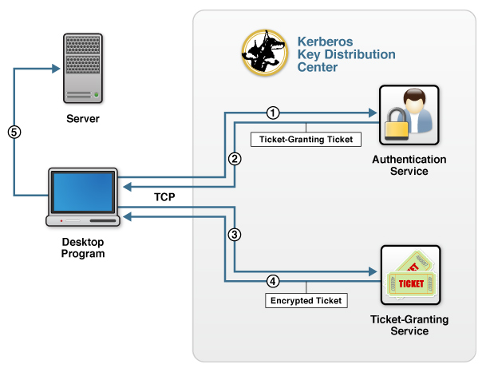

About Kerberos V5 Network Authentication 
=============================================================================================================

Kerberos provides user authentication or single sign-on (SSO) functionality by providing communication between trusted hosts on untrusted networks. Kerberos—named after Cerberus, the three-headed guard dog of the underworld in Greek mythology—is a ticket-based network authentication protocol in which clients send a request to a trusted <a name="kdc"></a>Key Distribution Center (KDC) for credentials to access another server. The credentials are encrypted using secret-key cryptography and no cleartext passwords are ever sent over the network. Additionally, Kerberos provides for mutual authentication between clients and servers and single sign-on.

For information on how to use KAAZING Gateway with Kerberos, see [Using Kerberos V5 Network Authentication with the Gateway](u_kerberos_configure.md).

Kerberos Network Authentication Overview
------------------------------------------------------------------------

A typical KDC contains two logically separate services that are usually combined in one physical location:

-   An Authentication Service (AS)
-   A Ticket Granting Service (TGS)

An example of a KDC server that provides both services on one server is Microsoft Active Directory. The two services are shown in the following figure:


**Figure: A KDC server providing both AS and TGS services on one server**

The figure shows how a client interacts with a server that requires Kerberos authentication:

1.  When the client attempts to log in, the client program sends a request for a ticket-granting ticket (TGT) to the AS in the KDC.
2.  The AS checks its account database for the user and returns a TGT and a session key containing unique client data (knows as the authenticator) that the client uses to encrypt communication with the TGS.
3.  The client sends the TGT and the target server's name to the ticket-granting service (TGS) in the KDC to get an encrypted ticket.
4.  The TGS examines the TGT and the client's authenticator, copies the client's identity from the TGT to a session ticket, and returns the encrypted ticket (a session ticket).
5.  The client program then uses the session ticket to authenticate with the server, which decrypts the session ticket and validates the authenticator to which it is trying to connect.

    **Note:** If there is mutual verification, then the server takes the client's authenticator timestamp and encrypts it with the session key the TGS provided, and then sends that back to the client.

The connection from the browser to the KDC uses TCP, not HTTP, although some Kerberos systems also support UDP. The client program runs on a machine that is logged on to a network (for example, a desktop computer logged in on a Windows domain) and has network access to the KDC.

The Simple and Protected GSSAPI Negotiation Mechanism (SPNEGO) provides a web-based way to supply an encrypted ticket to a web server. Internet Explorer, Mozilla Firefox, and Google Chrome support SPNEGO-based Kerberos V5 credential negotiation. In addition, KAAZING Gateway provides an implementation of Kerberos over WebSocket that enables you to extend Kerberos-based authentication over the web using the default web ports 80 and 443.

### How does Kerberos SPNEGO GSS-API work?

Consider a scenario where you have Kerberos in your environment and want to configure KAAZING Gateway's security to use Kerberos. In this scenario, suppose a web browser or client requests an access-protected document from the web server using a GET method request. The URI of the document is `http://www.example.com/dir/index.html`, and the browser sends the following request:

`GET dir/index.md`

No authorization header is sent the first time the browser requests the document, and KAAZING Gateway responds with an error saying that the browser could not authenticate, for example:

```
HTTP/1.1 401 Unauthorized
WWW-Authenticate: Negotiate
```

The browser then uses the SPNEGO GSS-API to obtain the user credentials using the SPNEGO GSS-API mechanism. The KDC generates the service ticket (or `gssapi-data`) to be sent by the browser to the Gateway with a new request, including an authorization header. For example:

```
GET dir/index.md
Authorization: Negotiate a87421000492aa874209af8bc028
```

The Gateway decodes the `gssapi-data` and passes this information to the SPNEGO GSS-API mechanism to validate the ticket granted. When the ticket is validated, the user is allowed access, otherwise the user is challenged again.

For information on how to using the Gateway and Kerberos, see [Using Kerberos V5 Network Authentication with the Gateway](u_kerberos_configure.md).

See Also
------------------------------

-   [Configure Kerberos V5 Network Authentication](o_auth_configure.md)
    -   [Configure a Ticket Protected Gateway](p_kerberos_configure_ticket_protected_gateway.md)
    -   [Configure a Ticket Granting Gateway](p_kerberos_configure_ticket_granting_gateway.md)

-   [Using Kerberos V5 Network Authentication with the Gateway](u_kerberos_configure.md)
