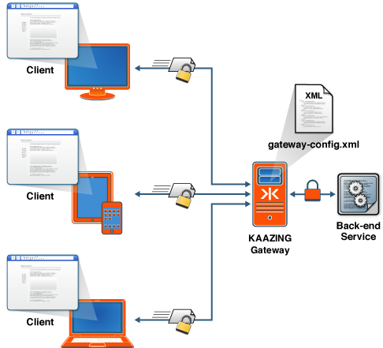

About Security with KAAZING Gateway
======================================================================================

Deploying applications over the Web presents security challenges that KAAZING Gateway takes very seriously. The Gateway adheres to the WebSocket specification of the HTML5 standard, and enhances the standard’s basic security aspects by building security features and functionality into the Gateway to keep users and information safe over the Web. These security features help to protect your data and let you authenticate that users are who they say they are, and that they take only authorized actions.

Whereas the WebSocket standard takes care of core security by providing a frame within which existing security protocols can operate, the Gateway enhances the WebSocket standard to provide a full security solution. The Gateway is a high performance platform that enables full-duplex Web communication between a browser and a back-end service or message broker, and it provides several mechanisms for secure end-to-end connectivity. This includes WebSocket Secure (WebSocket + TLS/SSL), W3C Cross-Origin Resource Sharing, customizable authentication and authorization, single sign-on capabilities, and other security features. Furthermore, the Gateway integrates with Java Authentication and Authorization Service (JAAS), thus supporting pluggable authentication and authorization modules.

For successful and secure communication, you must configure the Gateway to secure the back-end systems, servers, and applications, secure data traffic as it travels on the network, configure your clients to handle authentication requests, and configure authentication and authorization. The following figure shows end-to-end security in a Gateway environment.

**Figure: End-to-End Security in the Gateway Environment**

Each of the security objectives is broken down into step-by-step instructions in the Gateway documentation:

-   **Securing network traffic:** Network traffic going to and from the Gateway is not encrypted by default. You configure secure communication with the Gateway using Transport Layer Security (TLS, formerly known as SSL) to prevent unwanted eavesdropping, man-in-the-middle attacks, and packet sniffing. HTTP over TLS/SSL is called HTTPS, and WS (WebSocket) over TLS/SSL is called WebSocket Secure (WSS). See [Secure Network Traffic with the Gateway](o_tls.md) for an overview and step-by-step instructions.
-   **Configuring security for clients:** The Gateway provides client libraries that can respond to a variety of security challenges, such as HTTP Basic or HTTP Negotiate. In addition, you can customize the client challenge handler framework to work with any HTTP-based authentication scheme. This means that if you already have authentication or single sign-on capabilities in place, you can configure the Gateway to participate in your existing framework. In addition, you can customize the client challenge handler framework to work with any HTTP-based authentication scheme. For configuration instructions and code examples for writing custom challenge handlers, see the [For Developer](../index.md) documentation for developers that is specific to your client.
-   **Configuring authentication and authorization:** The Gateway streamlines the authentication and authorization process for users by employing features such as credential caching and single sign-on:

    -   **authentication** is the mechanism by which a system identifies a user and verifies whether or not the user really is who he represents himself to be. To start the authentication process, the Gateway issues a standard challenge using the `HTTP 401 Authorization Required` code. The browser or client then responds by providing the requested authentication information.
    -   **authorization** is the mechanism by which a system determines what level of access a particular user has. Even after a user is successfully authenticated for general access, it doesn't mean the user is entitled to perform any operation. Authorization is concerned with individual user rights. For example, what can the user do once authenticated---configure the device or only view the data? In this case you could authorize the user with viewer, moderator, or administrator privileges to the web page. Access rights are typically stored in the policy store that is associated with the application.
    -   **Single sign-on (SSO)** is the mechanism where users log in only once to access many different services. Under the covers, the client uses a single authentication token to access many different services. So, users log in only once and access to a layer of systems is centralized, removing the need to distribute usernames, passwords, and ACLs throughout the enterprise. The Gateway provides the ability to integrate with third party or custom single sign-on systems. In addition the Gateway is preintegrated for Kerberos authentication. Integration uses the customizable challenge handler framework and pluggable JAAS-driven server-side login in concert to implement a secure sign-on regime.

    Also, see [Configure Authentication and Authorization](o_auth_configure.md).

- **IP filtering** The Gateway provides the ability to filter remote host connections according to the IP addresses or a range of IP addresses. For more information, see [IP Filtering with Kaazing Gateway](security/p_geolocation_security.md).

-   **Leveraging** **Cross Origin Resource Sharing (CORS) and Cross Origin Access:** The HTML5 standard introduces Cross Origin Resource Sharing (CORS) that makes it possible to safely share and move data across domains. Prior to CORS, web browsers abided by the same-origin policy that restricted user access to documents within the same origin. With CORS, you can build web applications to access documents and services in different domains. This provides a great deal of flexibility when designing your architecture and partitioning up your services, rather than restricting everything to a single origin. In addition, you can expose public or semipublic cross origin WebSocket services. The Gateway uses the web origin security model to control access to services. It also emulates origin security for browsers and platforms that do not natively support it. You must explicitly enable cross origin access by setting the `allow-origin` element in the Gateway configuration (for example, in the `gateway-config.xml` file).

    See the descriptions of the `allow-origin` and `cross-site-constraint` elements in the [Service Reference](../admin-reference/r_configure_gateway_service.md#cross-site-constraint) documentation.

-   **Securing Gateway Management:** For administrators, the Gateway reaches across multiple operating environments, works with major browsers, across multiple protocols, and multiple client platforms. For secure management, the Gateway provides a way to specify the protocol, network interface, and the port number on which the management agent accepts connections. Plus, you can define the user roles that are authorized to perform management operations.
-   **Using Development APIs:** For developers, the Gateway offers client APIs that leverage existing knowledge and skill sets to minimize the time and resources required to implement security features. The APIs are familiar and support multiple platforms running under multiple protocols and client libraries. The client [API](../index.md) documentation and the "HowTo’s" available for developers on the home page help to facilitate the development process.

See Also
------------------------------

-   [About HTTPS and WSS](c_security_https_wss.md)
-   [About Authentication and Authorization](c_auth_about.md)
-   [About Kerberos V5 Network Authentication](c_authentication_kerberos.md)
-   [About Enterprise Shield™](../enterprise-shield/o_enterprise_shield_checklist.md#about-enterprise-shield)

To learn more about other administrative or developer tasks, refer to the [API documentation](../index.md).
