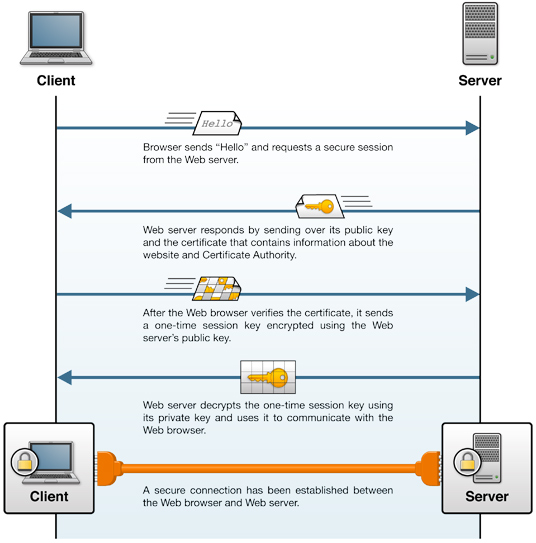
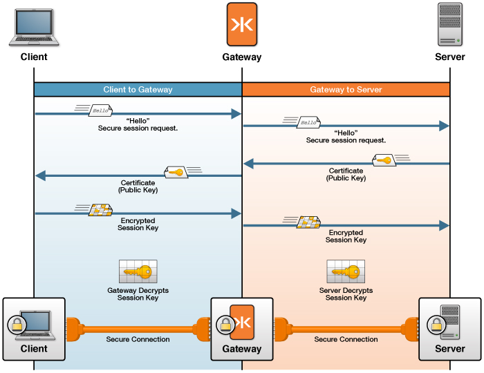

Transport Layer Security (TLS/SSL) Concepts
============================================================================================

This section is a high-level introduction to the technologies used to configure secure networking with KAAZING Gateway. Secure networking with the Gateway uses two networking protocols: Transport Layer Security (TLS/SSL) and its predecessor Secure Sockets Layer (SSL). For the purposes of this guide, we use TLS/SSL when discussing secure protocols because SSL, while still popular, has not been updated since SSL version 3.0 in 1996 and TLS/SSL continues to be developed into new versions.

The goal of TLS/SSL is to establish a secure session between two hosts on a network. The mechanism used to accomplish this goal is cryptography, which changes readable data into codes that are unreadable unless you know how the code was created. The process of encoding data is called encryption and the process of decoding that data is called decryption. The information used to perform encryption and decryption is called the *key*.

Cryptography always involved a symmetrical exchange of the key in order for two individuals to encrypt and decrypt shared information until the innovation of public key cryptography. Public key cryptography uses two keys, a public key used for encryption that is shared and a private key used for decryption that is not shared. These keys may only be used in conjunction with each other and are not related to any other keys. The public key is shared so that others can use it to encrypt data intended for its owner. The owner then uses the corresponding private key to decrypt that information.

A public key certificate, commonly called a *digital certificate* or just *certificate*, is a digitally-signed statement binding a public key to the identity of the host that owns the corresponding private key. Certificates ensure that the shared public keys used to encrypt private data come from whom they claim to come from. (Most certificates use the X.509v3 certificate standard.) A Public Key Infrastructure (PKI) is a trusted method of issuing and revoking certificates and the public keys they contain.

There is a public PKI used over the Internet but a PKI can be created within a corporate network as well. A PKI begins with a root Certification Authority (CA) that issues a certificate in response to a request from an individual that has already generated a private/public key pair. The certificate request is really a request to join the PKI and the certificate is only issued once the CA has verified the identity of the individual offline. The PKI can be extended to include many more subordinate Certificate Authorities in order to handle a large volume of requests. Whenever the certificate is used to send the public key, the certificate recipient verifies that the certificate was issued from a CA it trusts and can be traced back to the root CA for the PKI. Using this method, all members of the PKI can establish trust. It is important to note that only the owner of the certificate is verified, and anyone that uses the public key is not verified in any way.

TLS/SSL uses certificates to establish trust between two network hosts over TCP using the HTTPS and WSS (WebSocket Secure) protocols. Technically, HTTPS is not a separate protocol, but it is HTTP running on top of a TLS/SSL connection. Commonly, HTTPS uses a different port (HTTPS's default port is 443 and HTTP's default port is 80). HTTP runs directly on top of TCP and HTTPS runs on top of TLS/SSL, which, in turn, runs on top of TCP. The same is true for WSS connectivity. The WebSocket protocol runs on top of TCP (like HTTP), and the WSS protocol runs on top of TLS/SSL, which runs on TCP. WebSocket's default port is 80 and WSS uses port 443 by default.

Here’s how a TLS/SSL session between a client and web server is established.

**Figure: A TLS/SSL session between a client and web server**

The following figure shows how the Gateway uses TLS/SSL to secure network traffic with clients and back-end servers. See [How TLS/SSL Works with the Gateway](u_tls_works.md) for an in-depth discussion and examples of common TLS/SSL configurations with the Gateway.

**Figure: The Gateway Uses one TLS/SSL Certificate to Secure Network Traffic With Clients and a Separate TLS/SSL Certificate to Secure Network Traffic With Back-end Servers**

**Note:** The back-end server might be a back-end service or message broker or another Gateway. In most cases, a back-end service or message broker can be configured to ensure a connection uses TLS/SSL.

#### See Also

-   [Secure Network Traffic with the Gateway](o_tls.md)
-   [How TLS/SSL Works with the Gateway](u_tls_works.md)
