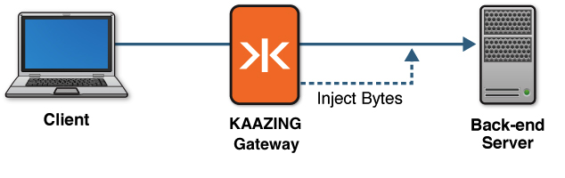

-   [Home](../../index.md)
-   [Documentation](../index.md)
-   Security with KAAZING Gateway

Implement Protocol Injection
===========================================================================

This topic describes Protocol Injection and how to configure KAAZING Gateway to implement protocol injection:

About Protocol Injection
-----------------------------------------------------------------

In many architectures, the back-end server may require specific information about the client, such as the user identity associated with a connection or session. Protocol injection enables you to securely propagate this information to your back-end server.

**Note:** While you can use protocol injection to inject information of your choosing, the most common usage is where your back-end server requires identity information about the client, and is the example for this topic.

Because the Gateway performs authentication, it is aware of the identity information associated with each client connection. After the the Gateway authenticates the client, the Gateway can inject a series of bytes conforming with the back-end server’s protocol, which can contain the identity information. By injecting this information, the back-end server can receive the information it expects in the format it expects.

You may choose to use protocol injection when you want to ensure that the client’s identity information comes from a validated and trusted source like the Gateway at the point of authentication. After you implement protocol injection, when the Gateway connects to the back-end server through the proxy service, the Gateway then sends the injected bytes. When the back-end server receives the expected bytes, the Gateway then sends data from the client, and traffic flows normally.

The following figure shows a high-level overview of how protocol injection works with the Gateway and your back-end server.



**Figure: Injecting Bytes into a Custom Protocol**

You can see a complete example of a sample login module that uses protocol injection by opening: `GATEWAY_HOME/web/extras/samples/security/IdentityInjectionLoginModule.java`.

Injecting Bytes into a Custom Protocol
-------------------------------------

The following procedure describes how to inject bytes into a custom protocol. To complete the steps in this topic, you must be familiar with the bytes (and the necessary encoding) that your back-end server requires.

1.  Create a new login module.

    **Note:** We recommend that you create a separate LoginModule specifically for the purpose of protocol injection. The steps in this topic assume that you already have an existing login module (either one supplied from the Gateway or one that you've created) that establishes the identity associated with this connection and authenticates it.

    In the login module, determine the identity or any other information you want to send to the back-end server. For example, you may want to inspect the Principals from other login modules in the chain to discover the identity associated with the client connection.

2.  Instantiate a new object of type `org.kaazing.gateway.server.spi.ProtocolInjection` and override the `getName()` and `getInjectableBytes()` methods.

    -   The `getName()` method should specify the name of this Principal to avoid conflicting with other Principals of the same type.
    -   The `getInjectableBytes()` returns the bytes which will be injected into the connection to the back-end server. The bytes must conform to the protocol that the server is expecting. Using this method, incorporate the identity or other information determined in step 1.
   
    See the [Protocol Injection](../apidoc/server/gateway/server/spi/index.html) documentation for more information.

3.  In your login module's `login()` method, add the newly created `ProtocolInjection` object (which is of type Principal) into the Subject. This causes the Gateway to call its `getInjectableBytes()` method and inject the bytes into the custom protocol.
4.  Compile your`LoginModule` class into a JAR file and put the JAR file in `GATEWAY_HOME/lib`.
5.  Update the Gateway configuration located in `GATEWAY_HOME/conf/` to add your new login module to the chain. This login module must be located after any other login modules on which it depends. The following configuration example shows the sample login module:

    ``` xml
    <security>
        ...
      <login-modules>
        <login-module>
        <type>file</type>
          <success>required</directory>
          <options>
            <file>jaas-config.xml</file>
          </options>
        </login-module>
        <login-module>
            <type>class:com.example.MyInjectionLoginModule</type>
        </login-module>
      </login-modules>
    </security>
    ```

    Note: For information about login modules, see [Configure a Chain of Login Modules](p_aaa_config_lm.md). the Gateway includes an [SPI (Service Provider Interface)](../apidoc/server/gateway/server/spi/index.md) called `ProtocolInjection`.

6.  Start (or restart) the Gateway, then connect a new client.

    After authentication succeeds, the Gateway establishes a connection to the back-end server. At this point, if a Principal of type `ProtocolInjection` is present, the Gateway sends the specified bytes to the back-end server before any data from the client are sent.

Congratulations! You have completed implementing protocol injection with the Gateway.


See Also
------------------------------
-  [Configure the Gateway](../admin-reference/o_conf_checklist.md)
-  [Configure Authentication and Authorization](o_aaa_config_authentication.md)
-  [SPI (Service Provider Interface)](../apidoc/server/gateway/server/spi/index.md).
