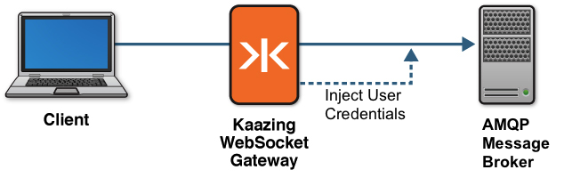

-   [Home](../../index.md)
-   [Documentation](../index.md)
-   Security with KAAZING Gateway

Promote User Identity into the AMQP Protocol
================================================

This topic describes User Identity Promotion and how to promote credentials into the AMQP protocol for back-end servers or brokers that require additional information. AMQP user identity promotion uses AMQP 0-9-1 and KAAZING Gateway.

About User Identity Promotion
------------------------------------------------

Typically, anonymous connections are not used in an enterprise application. Instead, users must provide credentials to access the AMQP message broker. However, because AMQP is a protocol, the credentials are supplied by the client. That means the credentials are prone to being manipulated.

User identity promotion enables the Gateway to securely propagate (promote) the user identity associated with a WebSocket connection or session from the client to the AMQP message broker. When a client connects to the Gateway, the client must first properly authenticate at the WebSocket transport layer before any AMQP messages are exchanged. Once the user's identity and authentication are established, the Gateway can then promote that identity by injecting the user's AMQP credentials into the protocol.

Thus, the AMQP message broker receives the credentials from the Gateway, which is a trusted source, and the credentials cannot be manipulated by users. The following figure shows a high-level overview of how protocol injection works with the Gateway and your AMQP message broker.



**Figure: Promoting User Credentials into the AMQP Protocol**
  
The AMQP message broker can perform its own authentication using the promoted identity. Note that it is not necessary for the credentials injected into the AMQP protocol to exactly match the user's identity. You need to supply only what is required for the AMQP message broker. For example:

- The username for AMQP may not match your system's single sign-on (SSO) username.

  Consider the case where the user logs into your web application using a global SSO username of joe.smith but the AMQP message broker username is smithj. In this situation, the Gateway can inject the correct credentials based on the user's identity, even when the credentials do not match the identity exactly.
- The credentials may be consolidated for AMQP.

  For example, all users should connect to the AMQP message broker as “webuser" instead of connecting their individual identity. In this case, users connect and authenticate to the Gateway using their unique identity, and thereafter are connected to the AMQP message broker as “webuser." Because this activity happens behind the Gateway, users are unaware.

Implementing AMQP User Identity Promotion
-----------------------------------------------------------
The following procedure describes how to implement AMQP user identity promotion with the Gateway

**Note:** The steps in this topic assume that you already have a LoginModule specifically for the purpose of user identity promotion. The LoginModule (either one supplied from the Gateway or one that you have created) establishes the identity associated with this connection and authenticates it.

1. In your login module, instantiate a new object of type `com.kaazing.gateway.server.spi.AmqpPrincipal` and add it to the Subject. This is typically done in the `commit()` method. For example:
  ``` xml
  private Subject subject;

  @Override
  public void initialize(Subject         subject,
                                         CallbackHandler callbackHandler, 
                                         Map<String, ?>  sharedState,
                                         Map<String, ?>  options) {
      this.subject = subject;
  }

  @Override
  public boolean commit() throws LoginException {
    // username, password, and subject are member variables
    // that must be set earlier in other parts of the 
    // LoginModule implementation. In this method, we use 
    // the username and password are used to create AmqpPrincipal  
    // and add it to the Subject. The username and password will 
    // then be automatically injected into the AMQP protocol.

    AmqpPrincipal principal = new AmqpPrincipal(username, password);
    subject.getPrincipals().add(principal)
    return true;
  }
  ```
  
   - You should add only one `AmqpPrincipal`.
   - If you add more than one `AmqpPrincipal` principal, then the Gateway uses the first one that the Java iterator happens to return to the Gateway.

  See the `AmqpPrincipal` method in the [SPI (Service Provider Interface)](../apidoc/server/gateway/server/spi/index.md) documentation for more information.

2. Compile your LoginModule and include it in a JAR file that you put into the `GATEWAY_HOME/lib` directory.

  **Note:** These instructions assume the jar `com.kaazing.gateway.amqp.server.spi.jar` is added to the compile-time classpath of the login module.

3. Start (or restart) the Gateway, and then connect a new client.

  After authentication succeeds, the Gateway establishes a connection to the back-end server or broker. At this point, if `AmqpPrincipal` is available in the Subject, then the Gateway automatically injects the AMQP credentials specified `AmqpPrincipal` into the AMQP protocol.
  
Congratulations! You have completed implementation for AMQP user identity promotion with the Gateway.

See Also
-------------------------------------------------------

- [Configure the Gateway](../admin-reference/o_conf_checklist.md)
- [Configure Authentication and Authorization](o_aaa_config_authentication.md)
- [Real-Time Interactive Guide to AMQP](../guide-amqp.md)
