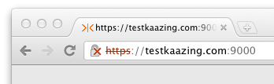

Secure the Gateway Using Self-Signed Certificates
============================================================================================================

**Warning:** Using self-signed certificates can result in unpredictable behavior because various browsers, plug-ins, operating systems, and related run-time systems handle self-signed certificates differently. Resulting issues may include connectivity failures and other security issues which can be difficult to diagnose. Instead, use [trusted certificates](p_tls_trusted.md) issued from a trusted certificate authority (CA) for real-world development, test, and production environments.

You can configure secure networking between KAAZING Gateway and its clients and back-end servers using **self-signed certificates**. A self-signed certificate is not issued from a trusted Certificate Authority (CA), but created independently and intended for limited use between individuals that trust its autonomy.

In this procedure, you will do the following:

1.  Configure the Gateway with a self-signed certificate for the Gateway’s host name, and then configure the Gateway with a directory service that uses that host name. This will configure the Gateway for TLS/SSL connections from clients.
2.  Configure the Gateway with a self-signed certificate for the back-end server’s host name, and configure the Gateway with a proxy service that accepts the WebSocket Secure (`wss://`) connection on the Gateway’s host name and connects over TLS/SSL to the back-end server. This will configure the Gateway for TLS/SSL connections to back-end servers.

Before You Begin
----------------

This procedure is part of [Secure Network Traffic with the Gateway](o_tls.md):

-   [Secure the Gateway Using Trusted Certificates](p_tls_trusted.md)
-   **Secure the Gateway Using Self-Signed Certificates**
-   [Secure Clients and Web Browsers with a Self-Signed Certificate](p_tls_clientapp.md)
-   [Require Clients to Provide Certificates to the Gateway](p_tls_mutualauth.md)

To Secure Gateway Connections Using Self-Signed Certificates
------------------------------------------------------------

1.  Identify the host name of the server running the Gateway. A certificate can be used with a single host name only. Clients and other user agents must be able to resolve the host name to the IP address of the server running the Gateway in order to establish a secure session with the Gateway.

    The Gateway supports certificates that are generated for wildcard domain names. For example, \*.example.com represents example.com and all of its subdomains such as my.example.com and secure-mail.example.com.

2.  Create the custom keystore password file for the Gateway to use. If you are using the default keystore password file you can skip this step. The Gateway is configured to use the default keystore and password already.
    1.  To create the password file, create a new text file using a text editor, enter a password, and save the password file in the directory `GATEWAY_HOME/conf` with the file extension .pw (for example, mykeystore.pw).
    2.  To configure the Gateway to use the custom keystore and password file, open the `GATEWAY_HOME/conf/gateway-config.xml` file in a text editor and update the `keystore` element (contained in the `security` element) to use the new keystore and the password file you created, as shown in the following example:

        ``` xml
                 <keystore>
                      <type>JCEKS</type>
                      <file>mykeystore.db</file>
                      <password-file>mykeystore.pw</password-file>
                  </keystore>
        ```

3.  Locate the Java `keytool` utility that is part of your Java installation. It can be found in the Java bin directory. For example, `C:\Program Files\Java\jdk1.7.0_21\bin` (Windows) or `/Library/Java/Home/bin` (Mac OS X).
4.  Create the following components in `GATEWAY_HOME/conf/` using keytool:

    -   A new key pair (private and public).
    -   A new certificate.
    -   The keystore that will contain the new key pair and certificate (if you do not use the default keystore).

    Here is an example of how to create these components:

    ```
    keytool -genkeypair -keystore C:\\*GATEWAY\_HOME*\\conf\\mykeystore.db -storetype JCEKS -storepass
    password -alias example.com -keyalg RSA -dname "CN=example.com, OU=Example, O=Example,
    L=Mountain View, ST=California, C=US"
    ```

    To troubleshoot TLS/SSL errors and exceptions, see [Troubleshooting KAAZING Gateway Security](../troubleshooting/p_troubleshoot_security.md).

    **Notes:**

    -   The password value for `-storepass` is in the keystore password file that is located in the `GATEWAY_HOME/conf` folder (for example, keystore.pw). You can open the file with a text editor to read the default password and enter it in the command.
    -   This example command generates a key pair (public key and its associated private key) and wraps the public key into an X.509 self-signed certificate. Both the key pair and the certificate are stored in the keystore file and identified by `example.com` (as specified by the `-alias` parameter).
    -   The CN (Common Name) and `alias` parameters must be the host name of the server that is running the Gateway, and it must resolve to the host’s IP address via DNS.
    -   The default size of generated keys is 1024 bytes. Certificate authorities are now requiring larger key sizes. To address this, you can add an optional parameter and specify the desired size, such as `-keysize 2048`.
    -   Although there are other tools available for making certificates, keytool is required because the Gateway uses the keystore database file created by keytool.

    The Gateway is now configured with a certificate for its host name, and you can use the host name to accept secure connections from clients over HTTPS or WSS.

5.  Configure the Gateway to accept secure communication requests at the same host name used in the certificate.

    For example, create a new `service` element and specify the secure URL (HTTPS) in the accept parameter for the directory service, as shown in the following example:

    ``` xml
     <service>
          <accept>https://www.example.com:9000/</accept>
          <type>directory</type>
          <properties>
              <directory>/base</directory>
              <welcome-file>index.md</welcome-file>
          </properties>
      </service>
    ```

6.  Save `gateway-config.xml`.
7.  Verify that the certificate is valid by starting the Gateway. If the Gateway does not start, it might not be accepting the same host name used in the certificate. Check the directory service in `gateway-config.xml` and confirm that the host name in the `service` element’s `accept-domain` matches the host name used in the certificate. If they do not match, update the `accept-domain` in `gateway-config.xml`, save the file, and then start the Gateway.

    To troubleshoot TLS/SSL errors and exceptions, see [Troubleshooting KAAZING Gateway Security](../troubleshooting/p_troubleshoot_security.md).

8.  Once the Gateway is running, enter the secure URL in a web browser using HTTPS, for example `https://www.example.com:9000`. The browser will display a warning stating that the certificate is not trusted. The warning is the result of using a self-signed certificate instead of a trusted certificate created by a Certification Authority. Accept the untrusted certificate and proceed to the web page.

    

    **Figure: A browser displays a warning stating that the certificate is not trusted**

    For information about importing a certificate into a web browser, see [Importing Self-Signed Certificates into a Web Browser](p_tls_clientapp.md#to-import-self-signed-certificates-into-a-web-browser).

    At this point, you have a self-signed certificate and have configured secure networking between the Gateway and web browser clients. Now you can configure the Gateway to connect securely with the back-end server by creating a self-signed certificate for the host name of the back-end server in the **truststore** on the Gateway. The truststore contains the certificates for use between the Gateway and back-end servers.

9.  Create the self-signed certificate for the server connection using the host name of the back-end server and save it in the truststore:

    ```
    keytool -genkeypair -keystore C:\\*GATEWAY\_HOME*\\conf\\truststore.db -storepass changeit -alias
    offline.example.com -keyalg RSA -dname "CN=offline.example.com, OU=Example, O=Example,
    L=Mountain View, ST=California, C=US"
    ```

    To troubleshoot TLS/SSL errors and exceptions, see [Troubleshooting KAAZING Gateway Security](../troubleshooting/p_troubleshoot_security.md).

    The Gateway is now configured with a certificate for the host name of the back-end server, and you can use the host name to connect to the back-end server over TLS/SSL. As an example, configure the Gateway to act as a back-end server proxy for the secure networking requests from the client.

10. Open `gateway-config.xml` again and add a new `service` element, as shown in the following example:

    ``` xml
         <service>
              <accept>wss://www.example.com:9001/</accept>
              <connect>ssl://offline.example.com:61617</connect>
              <type>proxy</type>
          </service>
    ```

    The Gateway will use the new `service` element to act as a proxy for the back-end server. The `service` element contains an `accept` URL for the WSS connection from the client and a `connect` URL for the connection to the back-end server using the security protocol of the back-end server (for example, SSL).

11. Restart the Gateway and verify that the certificate is valid by accessing the WSS URL configured in the Gateway. If you cannot connect to the back-end server through the Gateway over TLS/SSL, verify the certificate has not expired and that it exists in the truststore.

    If you did not configure and test the directory service earlier in this procedure, then you will need to do so now to have the web browser accept the self-signed certificate and then connect to the Gateway over WSS. Once the Gateway is running, enter the secure URL in a web browser using HTTPS, for example `https://www.example.com:9000`. The browser will display a warning saying that the certificate is not trusted. The warning is the result of using a self-signed certificate instead of a trusted certificate created by a Certification Authority (CA). Accept the untrusted certificate and proceed to the web page.

Next Steps
----------

[Secure Clients and Web Browsers with a Self-Signed Certificate](p_tls_clientapp.md)

Notes
-----

-   Using a self-signed certificate for the connection between a web browser client and the Gateway requires that the web browser first connect to the Gateway using HTTPS to download the self-signed certificate. Typically, the HTTPS connection is made by configuring the Gateway with a directory service using HTTPS, such as https://example.com. The web browser will warn the user that the Gateway is using an untrusted self-signed certificate. The user must accept the self-signed certificate in the web browser in order to establish trust with the Gateway and connect using WebSocket Secure (WSS). Users may also import the self-signed certificate into their web browser. For more information, see [Secure Clients and Web Browsers with a Self-Signed Certificate](p_tls_clientapp.md).
-   In this scenario, you are creating trust separate from a corporate or Internet Public Key Infrastructure (PKI). You might choose this configuration to test TLS/SSL with the Gateway, or you might not have a digital certificate from a CA but still want to ensure that WebSocket connections are not dropped by intermediaries such as proxy servers and firewalls.
-   The `service` element configures a directory service on the Gateway for the secure URL you specified (for example, `https://www.example.com:9000/`) and specifies a welcome file web page. The purpose of the web page is to connect a web browser to the Gateway over HTTPS and download the self-signed certificate. If you do not have a web page, you can use index.md page in the `GATEWAY_HOME/web/base` folder.
-   To support DSA certificates, you must add `ADH` to the `ssl.ciphers` element as follows: `<ssl.ciphers>HIGH,MEDIUM,ADH</ssl.ciphers>`. Do not use `ADH` with `DEFAULT`. DSA certificates are not recommended. See [Diffie-Hellman key exchange](http://en.wikipedia.org/wiki/Diffie%E2%80%93Hellman_key_exchange#Security) for more information. If you omit the `-keyalg` switch when you create a certificate using keytool, keytool generates a DSA certificate. You should always include `-keyalg RSA` when creating a certificate using keytool.
-   If you choose to use a password when generating key pairs (optional), ensure that all of the keys in your keystore are secured with the same password as the keystore. If no password is provided when generating a key pair (via `-genkeypair`), you are prompted for a password. If you press RETURN at the prompt, the key password is set to the same password as that used for the keystore. [Keytool](http://docs.oracle.com/javase/7/docs/technotes/tools/windows/keytool.html) allows you to secure keys with individual passwords (via the `-keypass` option) and add them into a keystore that uses a different password (via the <span class="uri" style="white-space:nowrap;">-storepass</span> option). When the Gateway attempts to access a key in a keystore configured in this manner, the Gateway fails to start and generates a Null Pointer Exception. The command `-keypasswd` changes the password under which the private key is protected. The command `-storepasswd` changes the password used to protect the integrity of the keystore contents.

See Also
-------------------------------

-   [Transport Layer Security (TLS/SSL) Concepts](c_tls.md)
-   [How TLS/SSL Works with the Gateway](u_tls_works.md)
