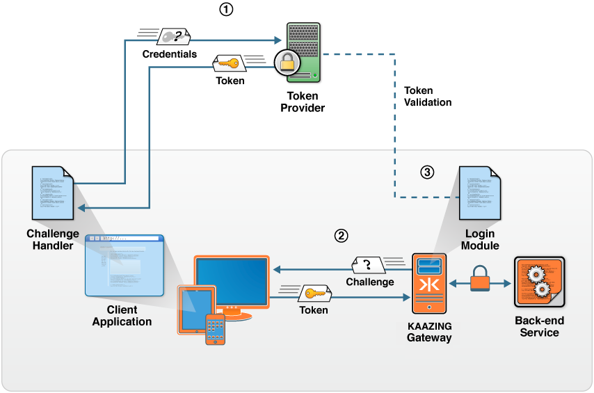

How Authentication and Authorization Work with the Gateway
=================================================================================================================

You implement authentication on two levels: you configure KAAZING Gateway to require authentication and you code clients to authenticate themselves to use the requested service.

At a high level, configuring authentication involves the following three steps:

1.  **On the Gateway:** Configure the HTTP challenge scheme to tell the Gateway how to challenge the client.
2.  **On the Gateway:** Configure a chain of login modules to tell the Gateway how to verify the client response.
3.  **On the Client:** Configure a challenge handler to respond to the authentication challenge.

**Note:** For Kerberos authentication and authorization, see [Configuring Kerberos V5 Network Authentication](o_kerberos.md).

Gateway-side authentication consists of configuring the following elements in the Gateway configuration (for example, in `GATEWAY_HOME/conf/gateway-config.xml`):

-   HTTP challenge schemes: The `http-challenge-scheme` element protects the Gateway service by defining the method used for authentication.
-   Realms: The `realm` element associates an authenticated user with a set of authorized roles. The Gateway checks the realm information to see which login module is associated with the realm and passes the encoded user's login credential values to it.
-   Login modules: The `login-module` element handles the challenge/response authentication sequence of events. You implement login modules using the [Java Authentication and Authorization Service (JAAS)](http://docs.oracle.com/javase/7/docs/technotes/guides/security/jaas/JAASRefGuide.html "JAAS Reference Guide") framework.

See the [Security Reference](../admin-reference/r_configure_gateway_security.md) for more information about the security configuration elements.

Client-side (application-level) authentication consists of challenge handlers and login handlers. The Gateway supplies client libraries that include the following classes:

-   Challenge handler: A challenge handler on the client receives the challenge from the Gateway, and is responsible for responding to the Gateway using the appropriate formatting. You use the `ChallengeHandler` class in your client code to deal with the `WWW-Authenticate ` and authorization headers, and to encode/decode the authentication scheme-specific challenge parameters.
-   Login Handler: You can also code a `LoginHandler` class, which is responsible for obtaining the credentials from the user (for example, a username/password, a secret passphrase, or a Kerberos ticket).

**Note:** You only need to configure a login handler if the client is going to collect credentials. Some applications are customized to handle credentials, so there is no need for a login handler.
Conceptually, a login module and challenge handler are paired, such that each is responsible for one side of the challenge/response sequence. Thus, if you are configuring a custom login module, then you must code the accompanying custom `ChallengeHandler` in the client.

The following figure provides a high-level look at the components and processes during authentication and authorization in the Gateway. In the figure:

-   Blue objects represent applications available on the client (challenge handler) and the Gateway (login module)
-   Orange objects are provided by KAAZING Gateway
-   Green objects are provided by third-party token suppliers (including KAAZING Gateway)

**Figure: Component and Process Interaction During Authentication and Authorization in the Gateway**

The sequence of events in the figure occur after the client requested access to a protected WebSocket connection in the Gateway and after the Gateway issues an authentication challenge back to the client.

1.  The client application uses a challenge handler to obtain a token from a third-party token provider.
2.  The challenge handler on the client uses its Gateway client interface to login and access a service via the Gateway by providing the Gateway with the token for authentication.
3.  The Gateway verifies the token using the token provider and either allows the WebSocket connecton to proceed (101 Protocol Upgrade), or denies the WebSocket creation request (403 Forbidden).

See Also
------------------------------

-   [Configure Authentication and Authorization](o_auth_configure.md)
-   [About Authentication and Authorization](c_auth_about.md)
