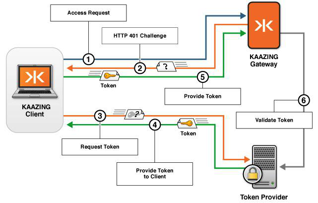

What Happens During Authentication
==================================================================================

The following figure shows what happens when a client application (for example, a JavaScript application running in a browser) requests a WebSocket connection to KAAZING Gateway. The request is made as part of a hosted web application that uses a third-party token provider.

**Figure: Authentication process between a client and the Gateway**

The figure illustrates how interactions between the client, the Gateway, and a third-party token provider result in authentication, as follows:

1.  The client requests access to a protected WebSocket connection in the Gateway by clicking a link on a web page, or entering a specific URL.
2.  The Gateway issues an authentication challenge using the `HTTP 401 Authorization Required` code to the browser. This response also contains a `WWW-Authenticate header`, whose value indicates the authentication scheme and any authentication or challenge parameters that the client can use to respond to the challenge.
3.  The client uses a third-party token provider to obtain a token that can be used as an authentication credential (other methods include a login page, a pop-up, and so on).
4.  The token provider provides the token.
5.  The client again requests a WebSocket connection to the Gateway, this time providing the third-party token (plus other challenge response data) via an authorization header in the HTTP request to the Gateway.
6.  The Gateway validates the token, either permitting the WebSocket connection to proceed (`101 Protocol Upgrade`), or denying the WebSocket creation request (`403 Forbidden`).

**Note:** In this example, token validation occurs between the Gateway and token provider. Also, you can perform token validation when you configure login modules in the Gateway configuration.

See Also
------------------------------

-   [Configure Authentication and Authorization](o_auth_configure.md)
-   [About Authentication and Authorization](c_auth_about.md)
