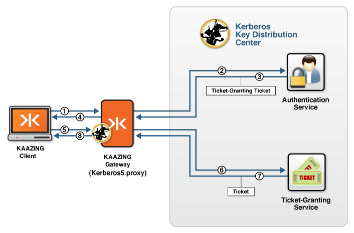

Using Kerberos V5 Network Authentication with the Gateway 
=================================================================================================================================

KAAZING Gateway supports the Kerberos authentication protocol, allowing you to proxy traffic to and from a KDC. This enables clients to communicate to a KDC over WebSocket. A gateway that is configured to proxy Kerberos traffic will be called a Ticket-Granting Gateway (TGG) in this section. This architecture provides all the benefits of a Kerberos-based security system to Web-based clients, without having to compromise overall site security by placing a KDC closer to the edge of the network.

**Figure: the Gateway is configured to proxy Kerberos traffic as a TGG**

1.  A KAAZING Gateway client running in a browser makes a request for a ticket from a TGG using a WebSocket-based connection.
2.  The TGG front-ends the KDC and proxies the incoming requests to the KDC, sending a request for a ticket-granting ticket (TGT) to the AS in the KDC.
3.  The AS returns a TGT.
4.  The TGG sends the TGT to the KAAZING Gateway client.
5.  The KAAZING Gateway client now makes a request for a ticket from a TGG using the TGT.
6.  The TGG sends the TGT to the ticket-granting service (TGS) in the KDC to get an encrypted ticket.
7.  The TGS returns encrypted ticket (the session ticket).
8.  The TGG proxies the encrypted ticket to the KAAZING Gateway client and it can now be used to access another service.

You can configure the Gateway to use the services of a KDC to provide Kerberos authentication for ticket-protected services running on the KAAZING Gateway. In this document, we will call a gateway that is configured that way a Ticket Protected Gateway (TPG).

See Also
------------------------------

-   [Configure Kerberos V5 Network Authentication](o_auth_configure.md)
    -   [Configure a Ticket Protected Gateway](p_kerberos_configure_ticket_protected_gateway.md)
    -   [Configure a Ticket Granting Gateway](p_kerberos_configure_ticket_granting_gateway.md)
