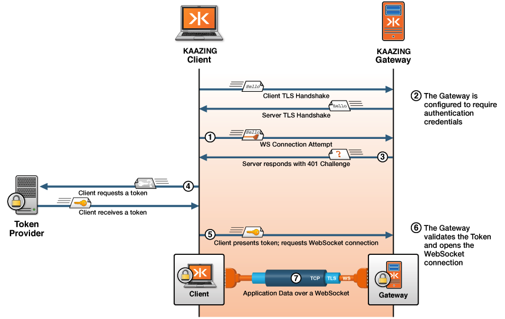

What’s Involved in Secure Communication
===========================================================================================

To better understand how the security parameters that you specify in KAAZING Gateway configuration (for example, `GATEWAY_HOME/conf/gateway-config.xml`) work together, let's take a detailed look at what is involved in the secure communication between the browser and KAAZING Gateway.

Suppose that a user requests content from the URL `wss://example.com:443/` (note that specifying port 443 in the URL is optional but it is included here for clarity) and that the echo service for this URL has been configured in the Gateway configuration to have a security constraint on it. For example, lines 5 to 7 in the following service element show that users who want access to the echo service must have the `AUTHORIZED` role:

``` xml
<service>
  <accept>wss://example.com:443/</accept>
  <type>echo</type>
  <realm-name>demo</realm-name>
  <authorization-constraint>
    <require-role>AUTHORIZED</require-role>
  </authorization-constraint>
</service>
```

The following sequence diagram illustrates the interactions that occur between the client and server to establish a client’s identity and open the WebSocket connection. Note that the numbers in the sequence diagram match the descriptions in the sequence of steps that follow the figure.



**Figure: Sequence Diagram Showing Authentication with the Gateway**

The following list describes in detail what happens under-the-hood when a client requests` wss://example.com:443`:

1.  **TLS/SSL Handshake:** Because the URL that is accessed is a WSS scheme, a TLS/SSL handshake takes place in which a public and private key for `example.com` are used to establish a shared secret used to encrypt and decrypt data. After the secure connection has been set up, the client sends the request to the Gateway.
2.  **Identify Authentication Scheme:** Because the Gateway is configured to require authentication, the Gateway:
    1.  Looks up the service that is registered for the requested URL and then checks if the service has security constraints applied to it. Because the `AUTHORIZED` constraint is present, the server tries to identify the client so that it can enforce the constraint.
    2.  Checks if either an authorization header or a session cookie was sent with the request, but the client has not sent those yet, because this is the first request.
    3.  Parses the URL that the client is trying to access and extracts the host name, which in this case is `example.com`.
    4.  Consults the configuration parameters that were supplied in the Gateway configuration (for example, `GATEWAY_HOME/conf/gateway-config.xml`) when the Gateway was started, looks for a `security` element and looks up the HTTP challenge scheme. The HTTP challenge scheme is shown in the following example:

        ``` xml
        <security>
        ...
        <!-- HTTP authentication configuration -->
        <http-challenge-scheme>Application Token</http-challenge-scheme>
        ...
        </security>
        ```

3.  **Challenge:** The Gateway sends back a response, challenging the user to supply login credentials. The Gateway uses the authentication scheme specified in the `http-challenge-scheme` element, which in this case is `Application Token`.
4.  **Token and Request:** The client sends a request to the third-party token provider to get a token with the credentials necessary to access the Gateway. The token provider may require the user to login or provide credentials in some other way.
5.  **Client Requests Access Again:** The client re-requests the original URL, but this time when challenged, the client returns the token (to provide the login credentials) to the Gateway.
6.  **Authentication:** The Gateway then:
    1.  Looks up the service that is registered for the requested URL and then checks if the service has security constraints applied to it. Because the `AUTHORIZED` constraint is present, the Gateway tries to identify the client so that it can enforce the constraint.
    2.  Finds the authorization header and decodes it to extract the supplied login credentials.
    3.  Parses the URL that the user is trying to access and extracts the host name, which in this case is `example.com`.
    4.  Looks at the Gateway configuration `realm` to look up the authentication information for the request. The `realm` element is part of the `security` element in the Gateway configuration, as shown in the following example:

        ``` xml
        <security>
          <keystore>
            <type>JCEKS</type>
            <file>keystore.db</file>
            <password-file>keystore.pw</password-file>
          </keystore>

          <truststore>
            <file>truststore.db</file>
          </truststore>

          <realm>
            <name>demo</name>
            <description>Demo</description>

            <authentication>
              <http-challenge-scheme>Application Basic</http-challenge-scheme>
              <http-header>Custom-Header-Name</http-header>
              <http-query-parameter>Query-Parameter-Name</http-query-parameter>
              <http-cookie>Cookie-Name</http-cookie>
              <authorization-timeout>30 minutes</authorization-timeout>
              <session-timeout>4 hours</session-timeout>
              <login-modules>
                <login-module>
                  <type>file</type>
                  <success>required</success>
                  <options>
                    <file>jaas-config.xml</file>
                  </options>
                </login-module>

                <login-module>
                  <type>ldap</type>
                  <success>required</success>
                  <options>
                    <userProvider>ldap://ldap-svr/ou=people,dc=example,dc=com</userProvider>
                    <userFilter>(&amp;(uid={USERNAME})(objectClass=inetOrgPerson))</userFilter>
                    <authzIdentity>{EMPLOYEENUMBER}</authzIdentity>
                  </options>
                </login-module>
              </login-modules>
            </authentication>
          </realm>
        </security>
        ```

        See the [Security Reference](../admin-reference/r_configure_gateway_security.md) documentation for more information about configuring the `security` element and its properties.

    5.  Checks the `realm` information to see which login modules are associated with it and passes them the encoded credentials.
    6.  Uses the realm login modules to authenticate the client’s credentials and establish the list of authorized roles. For example, `AUTHORIZED`. Because this realm uses a login module that is based on the Gateway token-based authentication protocol, the Gateway expects the client’s credentials to be a token.

        In this case, assume that the token is successfully authenticated and that the login module has established the client's list of authorized roles, based on the token.

    7.  Verifies that the client has been granted all the roles required by the authorization constraint for this request. If the client has not been fully authorized, then the server sends an additional challenge to the client.

7.  **Authorization:** When all roles required by the authorization constraint are granted to the client via the realm login module, then the WebSocket connection is successfully authenticated and established.

See Also
------------------------------

-   [About Security with KAAZING Gateway](c_security_about.md)
-   [About Enterprise Shield™ ](../enterprise-shield/o_enterprise_shield_checklist.md)
